[toc]


## 1.ANN的构建模块

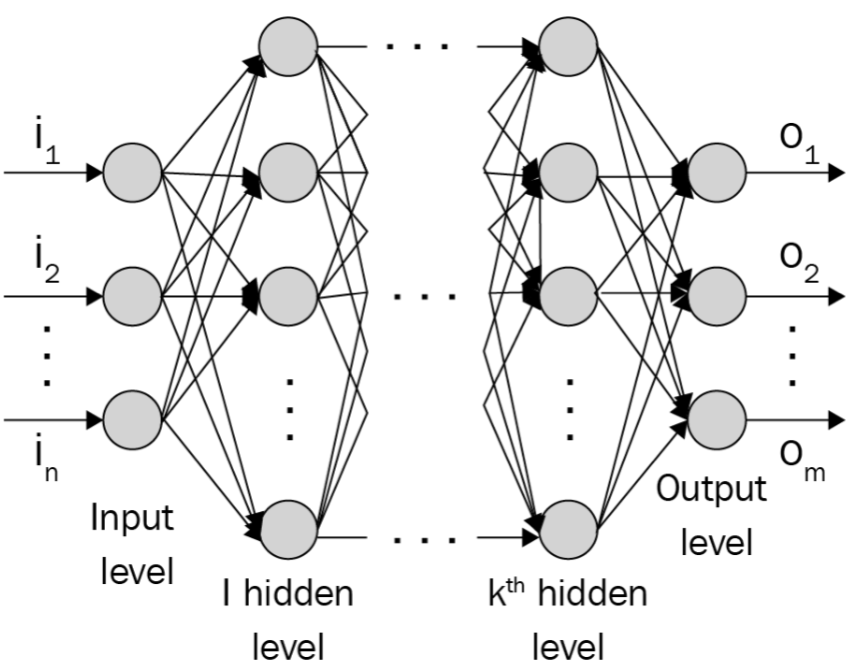

- 输入层，有n个节点作为输入。
- 隐藏层，从第1个隐藏层到第k个隐藏层。
- 输出层，有一个或多个节点作为输出。

放大某个隐藏层节点，对于该神经元的输入：

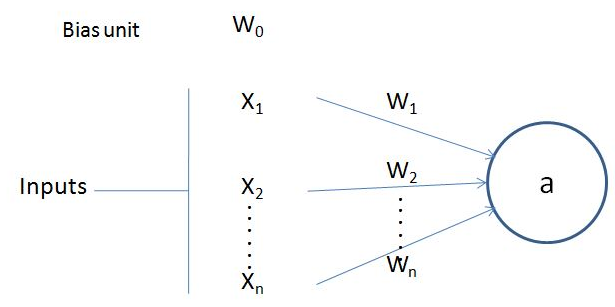

$x_1$ 到 $x_n$ 是输入变量，中间的连线是每个输入变量对应的权重 $w_1$ 到 $w_n$ ，此外还有个偏置项Bias unit $w_0$ ，输出值 $a$ 的计算公式：
$$
a = f(w_0 + \sum_{i=1}^{n} w_i x_i)
$$

- $f$ 为激活函数，用于将非线性作用域乘积之和上。


## 2.前向传播过程

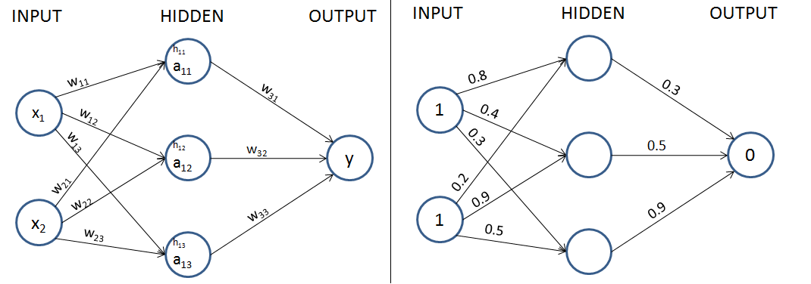

神经网络的输入是 $(1,1)$，对应的期望输出是 0 。

- 1.为所有连接分配随机值作为权重。为了简单起见，不包括偏置项。

- 2.计算激活前的隐藏层的值：

$$
h_{11} = x_1 w_{11} + x_2 w_{21} = 1
$$

$h_{12}$ 与 $h_{13}$ 类似，分别计算出为 1.3 和 0.8 。

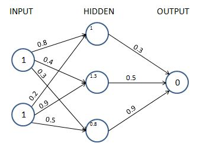

- 3.计算激活后的隐藏层的值，应用激活函数：

使用 Sigmoid 函数作为激活函数：$Sigmoid\ activation(x) = \frac{1}{1 + e^{-x}}$

对3个隐藏层应用激活函数 $S(x)$ 得到激活后的值：
$$
a_{11} = S(1.0) = \frac{1}{1+e^{-1.0}} = 0.73
$$
$a_{12}$ 与 $a_{13}$ 类似，分别计算出为 0.79 和 0.69 。

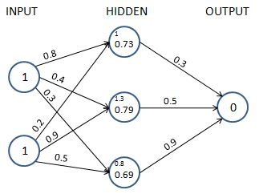

到此，我们获得了激活后的隐藏层的值。

- 4.计算输出层的值。

$$
\hat{y} = 0.73 \times 0.3 + 0.79 \times 0.5 + 0.69 \times 0.9 = 1.235
$$

- 5.计算损失值。

计算连续变量预测的损失：均方误差
$$
J_{\theta} = \frac{1}{m} \sum_{i=1}^{m} (y_i - \hat{y_i})^2 
$$
这里的 $m$ 是样本个数，$y_i$ 是某个样本的期望值，$\hat{y_i}$ 是该样本的预测值。

计算分类变量预测的损失：交叉熵

二元交叉熵计算公式：
$$
- \frac{1}{m} \sum_{i=1}^{m} (y_i \log(p_i) + (1-y_i) \log (1-p_i))
$$
这里的 $m$ 是样本个数，$y_i$ 为实际值，$p_i$ 为预测值。

一般的分类交叉熵计算公式：
$$
- \frac{1}{m} \sum_{i=1}^{m} \sum_{j=1}^{C} y_i \log(p_i) 
$$
这里的 $m$ 是样本个数，$C$ 为类别总数，$y_i$ 为实际值，$p_i$ 为预测值。预测值可以通过softmax激活函数获得。

对于 $C$ 个类别的分类，某个样本其所属类别使用one-hot编码表示，其实际值 $y_i$ 只有一个为1，其余为0，因此交叉熵损失可以如下表：

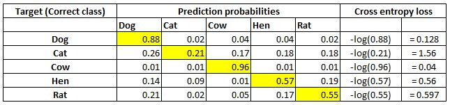


## 3.Numpy的广播机制

广播的核心概念是在进行运算时，NumPy会自动地处理具有不同形状的数组，使得它们能够相互匹配。这个过程分为以下几个步骤：

- **维度的增加**: 如果两个数组的维度不同，NumPy会在维度较小的数组的左侧添加大小为1的维度，直到两个数组的维度数相同。

```python
import numpy as np

# 创建一个形状为(3, 3)的数组
arr1 = np.array([[1, 2, 3],
                 [4, 5, 6],
                 [7, 8, 9]])

# 创建一个形状为(3,)的数组
arr2 = np.array([10, 20, 30])

# 对数组进行加法操作
result = arr1 + arr2

print(result)
'''
[[11 22 33]
 [14 25 36]
 [17 28 39]]
'''
```

在这个例子中，`arr1` 的形状是 (3, 3)，而 `arr2` 的形状是 (3,)，因此 `arr2` 的维度会被增加到与 `arr1` 的维度相同，即变为 (1, 3)。然后，进行下面的形状的匹配：`arr2` 在第一个维度上会被复制，扩展为与 `arr1` 相同的大小 (3, 3)，然后再进行加法操作。

- **形状的匹配**: 如果两个数组在某个维度上的大小不一致，但其中一个数组在该维度上的大小为1，那么 NumPy会沿着该维度复制元素，直到两个数组在该维度上的大小相同。

```python
import numpy as np

# 创建一个形状为(3, 3)的数组
arr1 = np.array([[1, 2, 3],
                 [4, 5, 6],
                 [7, 8, 9]])

# 创建一个形状为(1, 3)的数组
arr2 = np.array([[10, 20, 30]])

# 对数组进行加法操作
result = arr1 + arr2

print(result)
'''
[[11 22 33]
 [14 25 36]
 [17 28 39]]
'''
```

在这个例子中，`arr1` 的形状是 (3, 3)，而 `arr2` 的形状是 (1, 3)，因此 `arr2` 的维度会被增加到与 `arr1` 的维度相同，即变为 (3, 3)。然后，在第一个维度上，`arr2` 的值会被复制，扩展为与 `arr1` 相同的大小 (3, 3)，然后再进行加法操作。

- **无法匹配的情况**: 如果两个数组在某个维度上的大小都不相等且都不为1，那么会触发一个错误，表示无法进行广播。

```python
import numpy as np

# 创建一个形状为(3, 3)的数组
arr1 = np.array([[1, 2, 3],
                 [4, 5, 6],
                 [7, 8, 9]])

# 创建一个形状为(2, 2)的数组
arr2 = np.array([[10, 20],
                 [30, 40]])

# 对数组进行加法操作，会触发 ValueError
result = arr1 + arr2
```

在这个例子中，`arr1` 的形状是 (3, 3)，而 `arr2` 的形状是 (2, 2)，它们在维度和形状上都无法匹配，因此会触发 ValueError。


## 4.前向传播代码分析

- 初始化输入输出

```python
x = np.array([[1, 1]])
y = np.array([[0]])
```

输入为 $X_{1 \times 2}$，输出为 $Y_{1 \times 1}$

- 输入层和隐藏层的权重 $W_0$

**权重矩阵的维度应该考虑上层节点和下层节点数目**。

考虑输入层有2个节点，隐藏层有3个节点，所以权重矩阵 $W_0$ 为 `(1,3)`

```python
W0 = np.array([[-0.0053, 0.3793],
          [-0.5820, -0.5204],
          [-0.2723, 0.1896]], dtype=np.float32).T
```

- 与隐藏层节点相关的偏值项 $W_1$

**偏置项的维度应该与相关层的节点数目相同**。

考虑隐藏层有3个节点，所以偏值项 $W_1$ 为 `(1,3)`

```python
W1 = np.array([-0.0140, 0.5607, -0.0628], dtype=np.float32)
```

这里可以写成一维的形式 `(3,)`，下面会利用到广播机制， $W_1$ 维度的增加到 `(1,3)`

- 隐藏层和输出层的权重 $W_2$

考虑隐藏层有3个节点，输出层有1个节点，所以权重矩阵为 `(3,1)`

```python
W2 = np.array([[0.1528, -0.1745, -0.1135]], dtype=np.float32).T
```

- 与输出层节点相关的偏置项 $W_3$

输出层有1个节点，所以偏置项为 `(1,1)`

```python
W3 = np.array([-0.5516], dtype=np.float32)
```

这里可以写成一维的形式 `(1,)`，下面也会利用到广播机制。

---

给出前向传播代码：

```python
def feed_forward(inputs, outputs, weights):
    pre_hidden = np.dot(inputs, weights[0]) + weights[1]
    hidden = 1 / (1 + np.exp(-pre_hidden))
    pred_out = np.dot(hidden, weights[2]) + weights[3]
    mean_squared_error = np.mean(np.square(pred_out - outputs))
    return mean_squared_error
```

现在有一个小疑问，$x$ 与 $W[0]$ 相乘得到 `(1,3)` 的矩阵，而这个矩阵居然能够和 $W[1]$ 向量 `(3,)` 相加？

```python
x = np.array([[1, 1]])
y = np.array([[0]])

print(x.shape, x.ndim) # (1, 2) 2

W = [
    np.array([[-0.0053, 0.3793],
              [-0.5820, -0.5204],
              [-0.2723, 0.1896]], dtype=np.float32).T,
    np.array([-0.0140, 0.5607, -0.0628], dtype=np.float32),
    np.array([[0.1528, -0.1745, -0.1135]], dtype=np.float32).T,
    np.array([-0.5516], dtype=np.float32)
]

print(W[0].shape, W[0].ndim) # (2, 3) 2
print(W[1].shape, W[1].ndim) # (3,) 1

tmp = np.dot(x, W[0])
print(tmp, tmp.shape, tmp.ndim) # [[ 0.374  -1.1024 -0.0827]] (1, 3) 2

tmp = tmp + W[1]
print(tmp, tmp.shape, tmp.ndim) # [[ 0.36       -0.54170001 -0.1455    ]] (1, 3) 2
```

在最后的代码中利用了 Numpy 的广播机制：**如果数组的维度不同，NumPy会在较小数组的左边补1，直到两个数组的维度一致。**

tmp的维度为 `(1,3)`，所以 $W[1]$ 向量维度从 `(3,)` 增加到 `(1,3)` ，都是 $1 \times 3$ 的矩阵便可以相加。

---

上面矩阵乘法是 $Y=XW$ 的形式，现在我们改写矩阵的形状改写成 $Y=WX$ 的形式。

输入为 $X_{2 \times 1}$，因此 $W[0]$ 为 `(3,2)`，$W[1]$ 应为 `(3,1)`。

上面得到的  `(3,1)` 的结果作为新的输入 $X$，则 $W[2]$ 为 `(1,3)`，$W[3]$ 应为 `(1,1)`。

最终输出为 $Y_{1 \times 1}$。

在下面的代码中，我们修改了 $x$ ，$W[0]$，$W[2]$ 矩阵的形状，以及调整了 $x$ 和 $W[0]$ 的相乘顺序。

```python
x = np.array([[1],
              [1]])
y = np.array([[0]])

print(x.shape, x.ndim)  # (2, 1) 2

W = [
    np.array([[-0.0053, 0.3793],
              [-0.5820, -0.5204],
              [-0.2723, 0.1896]], dtype=np.float32),
    np.array([-0.0140, 0.5607, -0.0628], dtype=np.float32),
    np.array([[0.1528, -0.1745, -0.1135]], dtype=np.float32),
    np.array([-0.5516], dtype=np.float32)
]

print(W[0].shape, W[0].ndim)  # (3, 2) 2
print(W[1].shape, W[1].ndim)  # (3,) 1

tmp = np.dot(W[0], x)
print(tmp, tmp.shape, tmp.ndim)
# [[ 0.374 ]
#  [-1.1024]
#  [-0.0827]] (3, 1) 2


tmp = tmp + W[1]
print(tmp, tmp.shape, tmp.ndim)
# [[ 0.36        0.9347      0.3112    ]
#  [-1.11640001 -0.54170001 -1.1652    ]
#  [-0.0967      0.478      -0.1455    ]] (3, 3) 2
```

但在计算 $x$ 与 $W[0]$ 相乘得到的结果与 $W[1]$ 向量相加时却出错？

这里又是 Numpy 的广播机制：**如果两个数组在某个维度上的大小不一致，但其中一个维度的大小为1，那么这个维度上的大小会被扩展为另一个数组对应维度上的大小，NumPy会沿着该维度复制元素，直到两个数组在该维度上的大小相同。**

tmp的维度为 `(3,1)`，所以 $W[1]$ 向量维度从 `(3,)` 增加到 `(1,3)` ，然后 tmp 和 $W[1]$ 分别沿着第二维和第一维复制元素，都变为了 `(3,3)` 的形状。

为此，我们应该修改 $W[1]$ 为 `(3,1)` ，Numpy 的广播机制中如果在维度较小的数组的 **右** 侧添加大小为1的维度，那么我们就不用修改 $W[1]$ 了，但上面使用 $Y=XW$ 形式的代码中也会遇到这个问题。

```python
# np.array([-0.0140, 0.5607, -0.0628], dtype=np.float32)
W[1] = np.array([[-0.0140, 0.5607, -0.0628]], dtype=np.float32).T
```


## 5.前向传播代码

>  $Y = XW + B$

```python
import numpy as np

x = np.array([[1, 1]])
y = np.array([[0]])

W = [
    np.array([[-0.0053, 0.3793],
              [-0.5820, -0.5204],
              [-0.2723, 0.1896]], dtype=np.float32).T,
    np.array([-0.0140, 0.5607, -0.0628], dtype=np.float32),
    np.array([[0.1528, -0.1745, -0.1135]], dtype=np.float32).T,
    np.array([-0.5516], dtype=np.float32)
]


def feed_forward(inputs, outputs, weights):
    pre_hidden = np.dot(inputs, weights[0]) + weights[1]
    hidden = 1 / (1 + np.exp(-pre_hidden))
    pred_out = np.dot(hidden, weights[2]) + weights[3]
    print(pred_out)
    mean_squared_error = np.mean(np.square(pred_out - outputs))
    return mean_squared_error


print(feed_forward(x, y, W))
'''
[[-0.57840305]]
0.33455008989960927
'''
```

> $Y = WX + B$

```python
import numpy as np

x = np.array([[1],
              [1]])
y = np.array([[0]])

W = [
    np.array([[-0.0053, 0.3793],
              [-0.5820, -0.5204],
              [-0.2723, 0.1896]], dtype=np.float32),
    np.array([[-0.0140, 0.5607, -0.0628]], dtype=np.float32).T,
    np.array([[0.1528, -0.1745, -0.1135]], dtype=np.float32),
    np.array([-0.5516], dtype=np.float32)
]


def feed_forward(inputs, outputs, weights):
    pre_hidden = np.dot(weights[0], inputs) + weights[1]
    hidden = 1 / (1 + np.exp(-pre_hidden))
    pred_out = np.dot(weights[2], hidden) + weights[3]
    print(pred_out)
    mean_squared_error = np.mean(np.square(pred_out - outputs))
    return mean_squared_error


print(feed_forward(x, y, W))
'''
[[-0.57840305]]
0.33455008989960927
'''
```


## 6.激活函数与损失函数代码

```python
def sigmoid(x):
    return 1 / (1 + np.exp(-x))


def tanh(x):
    return (np.exp(x) - np.exp(-x)) / (np.exp(x) + np.exp(-x))


def relu(x):
    return np.maximum(0, x)


def linear(x):
    return x


def softmax(x):
    return np.exp(x) / np.sum(np.exp(x))
```

```python
def mse(p, y):
    return np.mean(np.square(p - y))


def mae(p, y):
    return np.mean(np.abs(p - y))


def cross_entropy_error(p, y):
    return -np.mean(np.sum(y * np.log(p)))
```


## 7.梯度下降：基于损失的变化更新权重

使用以下步骤减小损失值：

- 1.少量改变神经网络中的每个权重（每次一个）
- 2.当权重改变（$\delta W$）时，度量损失的变化（$\delta L$）
- 3.将权重更新为 $-k \cdot \frac{\delta L}{\delta W}$ ，$k$ 为学习率

梯度下降的代码：更新权重

```python
def update_weights(inputs, outputs, weights, lr):
    original_weights = deepcopy(weights)
    updated_weights = deepcopy(weights)
    # 记录使用当前权重进行前向传播时的损失值
    original_loss = feed_forward(inputs, outputs, original_weights)
    
    
    for i, layer in enumerate(original_weights):
        # 迭代每一层的权重
        for index, weight in np.ndenumerate(layer):
            # 迭代每个权重值
            temp_weights = deepcopy(weights)
            
            # 求梯度：微小改变权重后的损失值减去原损失值除以微小改变
            temp_weights[i][index] += 0.0001
            _loss_plus = feed_forward(inputs, outputs, temp_weights)
            grad = (_loss_plus - original_loss) / (0.0001)
            
            # 更新权重
            updated_weights[i][index] -= grad * lr
    return updated_weights, original_loss

import matplotlib.pyplot as plt

losses = []
for epoch in range(100):
    W, loss = update_weights(x, y, W, 0.01)
    losses.append(loss)
plt.plot(losses)
plt.title('Loss over increasing number of epochs')
plt.show()
```

上面代码中传入的 $W$ 是一个列表，里面包含4个权重矩阵，使用 `enumerate` 可以遍历每层的权重。 而使用  `np.ndenumerate` 用于遍历一层中的所有权重。

 `np.ndenumerate` 函数用于迭代多维数组中的元素及其对应的索引位置。其用法如下：返回的迭代器每次产生一个元组，其中包含当前元素的索引和值。

```python
import numpy as np

# 创建一个示例多维数组
arr = np.array([[1, 2, 3],
                [4, 5, 6]])

# 使用 np.ndenumerate 迭代多维数组
for index, value in np.ndenumerate(arr):
    print(index, value)
'''
(0, 0) 1
(0, 1) 2
(0, 2) 3
(1, 0) 4
(1, 1) 5
(1, 2) 6
'''
```

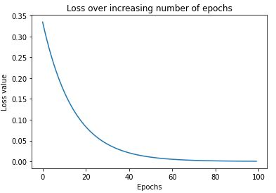


## 8.梯度下降：链式法则

使用链式法则，不需要手动计算损失值而获得与权重值相关的损失梯度。

链式法则的推导：以 $W_{11}$ 为例

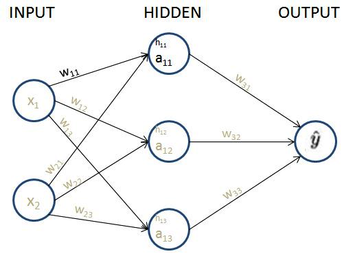

网络损失值的计算公式：$MSE\ LOSS(C) = (y - \hat{y})^2$

预测值 $\hat{y}$ 的计算公式：$\hat{y} = a_{11} \times w_{31} + a_{12} \times w_{32} + a_{13} \times w_{33}$

**隐藏层激活值**的计算公式：$a_{11} = sigmoid(h_{11})$

**隐藏层值**的计算公式：$h_{11} = x_1 \times w_{11} + x_2 \times w_{21}$

由链式求导法则，损失值对 $w_{11}$ 的导数：
$$
\frac{\partial{C}}{\partial{w_{11}}} = \frac{\partial{C}}{\partial{\hat{y}}} \times \frac{\partial{\hat{y}}}{\partial{a_{11}}} \times \frac{\partial{a_{11}}}{\partial{h_{11}}} \times \frac{\partial{h_{11}}}{\partial{w_{11}}}
$$
最终有 
$$
\frac{\partial{C}}{\partial{w_{11}}} = -2(y-\hat{y}) \times w_{31} \times a_{11}(1-a_{11}) \times x_1
$$
现在令 $\delta^o = (\hat{y}-y)a_{11}(1-a_{11})$，忽略系数2

则 $\frac{\partial{C}}{\partial{w_{11}}} = \delta^o \times w_{31} \times x_1$

这里引入 $\delta$ 可以理解为当前连接 $w_{ij}$ 对误差函数的贡献值。

[反向传播算法详细推导](https://www.cnblogs.com/jsfantasy/p/12177275.html)

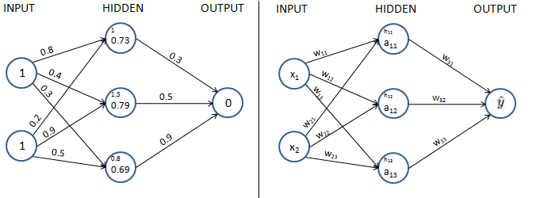

> 挖个坑：GPT搜索：
> 反向传播推导中的 $\delta$ 变量及其迭代实现
> 使用numpy实现一个五层的MLP的反向传播过程，并给出 $\delta$ 的迭代过程，详细解释每行代码

让我们使用 NumPy 来实现一个包含 5 层的 MLP，并详细解释每行代码的作用，包括 $\delta$ 的迭代过程：

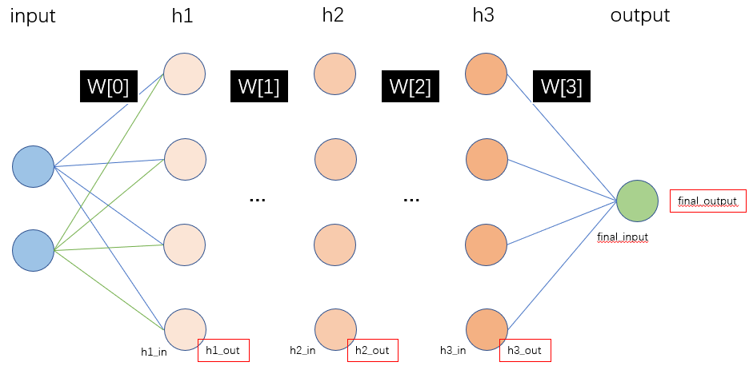

```python
import numpy as np
from matplotlib import pyplot as plt


# 定义 sigmoid 激活函数
def sigmoid(x):
    return 1 / (1 + np.exp(-x))


# 定义 sigmoid 函数的导数
def sigmoid_derivative(x):
    return x * (1 - x)


# 前向传播函数
def forward_propagation(inputs, weights):
    # 计算隐藏层1的输出
    hidden_inputs1 = np.dot(inputs, weights[0])
    hidden_outputs1 = sigmoid(hidden_inputs1)

    # 计算隐藏层2的输出
    hidden_inputs2 = np.dot(hidden_outputs1, weights[1])
    hidden_outputs2 = sigmoid(hidden_inputs2)

    # 计算隐藏层3的输出
    hidden_inputs3 = np.dot(hidden_outputs2, weights[2])
    hidden_outputs3 = sigmoid(hidden_inputs3)

    # 计算输出层的输出
    final_inputs = np.dot(hidden_outputs3, weights[3])
    final_outputs = sigmoid(final_inputs)

    return hidden_outputs1, hidden_outputs2, hidden_outputs3, final_outputs


# 反向传播函数
def back_propagation(inputs, targets, hidden_outputs1, hidden_outputs2, hidden_outputs3, final_outputs, weights,
                     learning_rate):
    # 计算输出层的误差和 \delta
    output_errors = targets - final_outputs
    output_delta = output_errors * sigmoid_derivative(final_outputs)

    # 计算隐藏层3的误差和 \delta
    hidden_errors3 = np.dot(output_delta, weights[3].T)
    hidden_delta3 = hidden_errors3 * sigmoid_derivative(hidden_outputs3)

    # 计算隐藏层2的误差和 \delta
    hidden_errors2 = np.dot(hidden_delta3, weights[2].T)
    hidden_delta2 = hidden_errors2 * sigmoid_derivative(hidden_outputs2)

    # 计算隐藏层1的误差和 \delta
    hidden_errors1 = np.dot(hidden_delta2, weights[1].T)
    hidden_delta1 = hidden_errors1 * sigmoid_derivative(hidden_outputs1)

    # 更新输出层权重
    weights[3] += learning_rate * np.dot(hidden_outputs3.T, output_delta)

    # 更新隐藏层3权重
    weights[2] += learning_rate * np.dot(hidden_outputs2.T, hidden_delta3)

    # 更新隐藏层2权重
    weights[1] += learning_rate * np.dot(hidden_outputs1.T, hidden_delta2)

    # 更新隐藏层1权重
    weights[0] += learning_rate * np.dot(inputs.T, hidden_delta1)

    return weights


# 主函数
def main():
    # 初始化输入数据和目标数据
    inputs = np.array([[0, 0], [0, 1], [1, 0], [1, 1]])
    targets = np.array([[0], [1], [1], [0]])

    # 初始化权重
    weights = [np.random.rand(2, 4), np.random.rand(4, 4), np.random.rand(4, 4), np.random.rand(4, 1)]

    # 设置学习率
    learning_rate = 0.1

    losses = []
    # 训练神经网络
    for i in range(100):
        hidden_outputs1, hidden_outputs2, hidden_outputs3, final_outputs = forward_propagation(inputs, weights)
        weights = back_propagation(inputs, targets, hidden_outputs1, hidden_outputs2, hidden_outputs3, final_outputs,
                                   weights, learning_rate)
        loss = np.mean(np.square(targets - final_outputs))
        losses.append(loss)
        if i % 1000 == 0:
            print(f"Iteration {i}, Loss: {loss}")

    print("\nFinal hidden layer outputs:")
    print("Hidden Layer 1:")
    print(hidden_outputs1)
    print("Hidden Layer 2:")
    print(hidden_outputs2)
    print("Hidden Layer 3:")
    print(hidden_outputs3)
    print("Final predictions:")
    print(final_outputs)

    plt.plot(losses)
    plt.title('Loss over increasing number of epochs')
    plt.show()


if __name__ == "__main__":
    main()
```

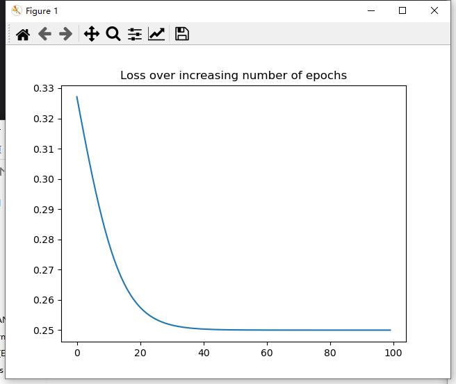

仔细分析反向传播的代码，可以总结出：

> 1.对于网络中的某层，有输入、输出、误差和 $\delta$ 参数。输入输出可以通过前向传播计算得到， $\delta$ 的计算依赖于误差和输出，而误差的计算依赖于下层的 $\delta$ 和本层与下层之间的权重矩阵。
>
> 2.权重的更新依赖于上层的输出和下层的 $\delta$ 

使用循环改写上面的代码：

```python
import numpy as np
from matplotlib import pyplot as plt


# 定义 sigmoid 激活函数
def sigmoid(x):
    return 1 / (1 + np.exp(-x))


# 定义 sigmoid 函数的导数
def sigmoid_derivative(x):
    return x * (1 - x)


# 前向传播函数
def forward_propagation(inputs, weights):
    outputs = [inputs]
    for i in range(len(weights)):
        hidden_inputs = np.dot(outputs[-1], weights[i])
        hidden_outputs = sigmoid(hidden_inputs)
        outputs.append(hidden_outputs)
    return outputs[1:]


# 反向传播函数
def back_propagation0(inputs, targets, outputs, weights, learning_rate):
    deltas = []
    output_errors = targets - outputs[-1]
    output_delta = output_errors * sigmoid_derivative(outputs[-1])
    deltas.append(output_delta)
    for i in range(len(weights) - 1, 0, -1):
        hidden_errors = np.dot(deltas[-1], weights[i].T)
        hidden_delta = hidden_errors * sigmoid_derivative(outputs[i - 1])
        deltas.append(hidden_delta)
    deltas.reverse()
    for i in range(len(weights)):
        weights[i] += learning_rate * np.dot(outputs[i].T, deltas[i])
    return weights


def back_propagation(inputs, targets, outputs, weights, learning_rate):
    deltas = []
    for i in reversed(range(len(weights))):
        if i == len(weights) - 1:
            # 计算输出层的误差和 δ
            output_errors = targets - outputs[i]
            delta = output_errors * sigmoid_derivative(outputs[i])
            deltas.append(delta)
        else:
            # 计算隐藏层的误差和 δ
            delta = np.dot(deltas[-1], weights[i + 1].T) * sigmoid_derivative(outputs[i])
            deltas.append(delta)

    deltas.reverse()  # 反转误差列表以匹配权重列表的顺序

    for i in range(len(weights)):
        if i == 0:
            weights[i] += learning_rate * np.dot(inputs.T, deltas[i])
        else:
            weights[i] += learning_rate * np.dot(outputs[i].T, deltas[i])

    return weights


def main():
    # 初始化输入数据和目标数据
    inputs = np.array([[0, 0], [0, 1], [1, 0], [1, 1]])
    targets = np.array([[0], [1], [1], [0]])

    # 初始化权重
    weights = [np.random.rand(2, 4), np.random.rand(4, 4), np.random.rand(4, 4), np.random.rand(4, 1)]

    # 设置学习率
    learning_rate = 0.1

    losses = []
    # 训练神经网络
    for i in range(100):
        outputs = forward_propagation(inputs, weights)
        weights = back_propagation(inputs, targets, outputs, weights, learning_rate)
        loss = np.mean(np.square(targets - outputs[-1]))
        losses.append(loss)
        if i % 20 == 0:
            print(f"Iteration {i}, Loss: {loss}")

    print("\nFinal hidden layer outputs:")
    for i, output in enumerate(outputs[:-1], start=1):
        print(f"Hidden Layer {i}:")
        print(output)
    print("Final predictions:")
    print(outputs[-1])

    plt.plot(losses)
    plt.title('Loss over increasing number of epochs')
    plt.show()


if __name__ == "__main__":
    main()
```


## 总结

- 对于一般地 $Y=XW$ 形式，$W$ 矩阵的维度为 `(上一层节点个数,下一层节点个数)`，$B$ 向量为 `(下一层节点个数)`，在下面的计算过程中 $B$ 可以利用Numpy的广播机制。

- 对反向传播过程：

  > 1.对于网络中的某层，有输入、输出、误差和δ参数。输入输出可以通过前向传播计算得到，δ的计算依赖于误差和输出，而误差的计算依赖于下层的δ和本层与下层之间的权重矩阵。
  >
  > 2.权重的更新依赖于上层的输出和下层的δ

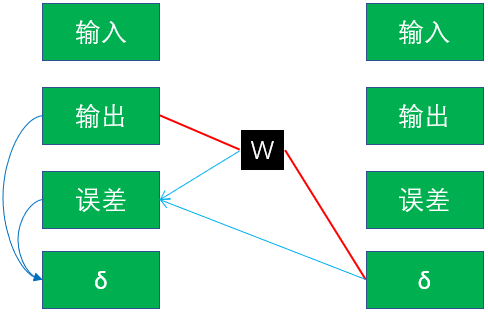


