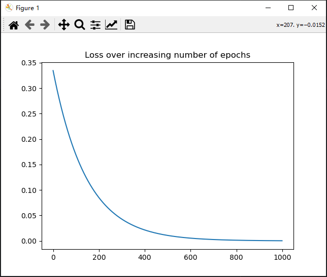

[toc]


# ANN的PyTorch实现

## 1.PyTorch

### 1.1PyTorch张量对象的自动梯度

```python
import torch

x = torch.tensor([[2., -1.], [1., 1.]], requires_grad=True)
print(x)

out = x.pow(2).sum()

out.backward()

print(x.grad)
'''
tensor([[ 2., -1.],
        [ 1.,  1.]], requires_grad=True)
tensor([[ 4., -2.],
        [ 2.,  2.]])
'''
```

- `requires_grad` 参数指定要为张量对象计算梯度
- `backward()` 方法计算 `out` 方式定义的函数的梯度
- `x.grad` 输出梯度

下面的代码使用PyTorch在一次前向传播后计算梯度，并做出一次权重更新

```python
from copy import deepcopy

import numpy as np
import torch
from matplotlib import pyplot as plt

x = np.array([[1, 1]])
y = np.array([[0]])
x, y = [torch.tensor(i).float() for i in [x, y]]

W = [
    np.array([[-0.0053, 0.3793],
              [-0.5820, -0.5204],
              [-0.2723, 0.1896]], dtype=np.float32).T,
    np.array([-0.0140, 0.5607, -0.0628], dtype=np.float32),
    np.array([[0.1528, -0.1745, -0.1135]], dtype=np.float32).T,
    np.array([-0.5516], dtype=np.float32)
]

W = [torch.tensor(i, requires_grad=True) for i in W]


def feed_forward(inputs, outputs, weights):
    pre_hidden = torch.matmul(inputs, weights[0]) + weights[1]
    hidden = 1 / (1 + torch.exp(-pre_hidden))
    out = torch.matmul(hidden, weights[2]) + weights[3]
    mean_squared_error = torch.mean(torch.square(out - outputs))
    return mean_squared_error


lr = 0.001
losses = []

updated_W = [w.clone().detach().requires_grad_(True) for w in W]

for i in range(1000):
    loss = feed_forward(x, y, updated_W)
    if i % 20 == 0:
        print(loss.item())  # 使用item()来获取loss的标量值
    losses.append(loss.item())

    loss.backward()

    # 在梯度更新之后，需要手动清零梯度
    for i in range(len(updated_W)):
        with torch.no_grad():
            updated_W[i] -= lr * updated_W[i].grad

        # 每次迭代后清零梯度
        updated_W[i].grad.zero_()

plt.plot(losses)
plt.title('Loss over increasing number of epochs')
plt.show()
```




### 1.2PyTorch张量对象注册到设备中

```python
import numpy as np
import torch

import time


def numpy_test():
    x = np.random.random((1, 6400))
    y = np.random.random((6400, 5000))
    start_time = time.time()
    z = np.matmul(x, y)
    end_time = time.time()
    execution_time = end_time - start_time
    print("numpy_test：", execution_time, "秒")


def torch_test_gpu():
    x = torch.rand(1, 6400)
    y = torch.rand(6400, 5000)

    device = 'cuda' if torch.cuda.is_available() else 'cpu'
    assert device == 'cuda', "This exercise assumes the notebook is on a GPU machine"

    x, y = x.to(device), y.to(device)
    start_time = time.time()
    z = (x @ y)
    end_time = time.time()
    execution_time = end_time - start_time
    print("torch_test_gpu：", execution_time, "秒")


def torch_test_cpu():
    x = torch.rand(1, 6400)
    y = torch.rand(6400, 5000)
    x, y = x.cpu(), y.cpu()
    start_time = time.time()
    z = (x @ y)
    end_time = time.time()
    execution_time = end_time - start_time
    print("torch_test_cpu：", execution_time, "秒")


if __name__ == '__main__':
    numpy_test()
    torch_test_gpu()
    torch_test_cpu()
'''
numpy_test： 0.008001565933227539 秒
torch_test_gpu： 0.021004438400268555 秒
torch_test_cpu： 0.00400090217590332 秒

numpy_test： 0.009002923965454102 秒
torch_test_gpu： 0.020004987716674805 秒
torch_test_cpu： 0.00400090217590332 秒
'''
```

运行两次结果都是 `torch.cpu > np > torch.gpu` 不知道为什么和书中的 `torch.gpu > torch.cpu > np` 不一样？


## 2.使用PyTorch构建神经网络

### 2.1小数据集上的使用

> 实现两个数相加的神经网络

```python
import torch
import torch.nn as nn
from matplotlib import pyplot as plt
from torch.optim import SGD

x = [[1, 2], [3, 4], [5, 6], [7, 8]]
y = [[3], [7], [11], [15]]

X = torch.tensor(x).float()
Y = torch.tensor(y).float()
device = 'cuda' if torch.cuda.is_available() else 'cpu'
X = X.to(device)
Y = Y.to(device)


class MyNeuralNet(nn.Module):
    def __init__(self):
        super().__init__()
        self.input_to_hidden_layer = nn.Linear(2, 8)
        self.hidden_layer_activation = nn.ReLU()
        self.hidden_to_output_layer = nn.Linear(8, 1)

    def forward(self, x):
        x = self.input_to_hidden_layer(x)
        x = self.hidden_layer_activation(x)
        x = self.hidden_to_output_layer(x)
        return x


mynet = MyNeuralNet().to(device)
loss_func = nn.MSELoss()

_Y = mynet(X)
loss_value = loss_func(_Y, Y)
print(loss_value)

opt = SGD(mynet.parameters(), lr=0.001)

loss_history = []
for _ in range(50):
    opt.zero_grad()
    loss_value = loss_func(mynet(X), Y)
    loss_value.backward()
    opt.step()
    loss_history.append(loss_value.item())

plt.plot(loss_history)
plt.title('Loss variation over increasing epochs')
plt.xlabel('epochs')
plt.ylabel('loss value')
plt.show()
```

构建网络模型架构：

- `torch.nn` 模块包含有助于构建神经网络模型的函数
- 使用模块创建模型框架时，必须要继承 `nn.Module` ，它是所有神经网络模块的基类
- `__init__` 方法中必须要调用 `super().__init__()` 
- 前向传播必须使用 `forward` 函数名

使用上：

- 定义一个实例，并注册到 device 上

- 获取每一层的权重和偏置项：

  ```python
  print(mynet.input_to_hidden_layer.weight)
  print(mynet.input_to_hidden_layer.bias)
  '''
  Parameter containing:
  tensor([[ 0.1830, -0.3889],
          [-0.5521,  0.2786],
          [ 0.3205,  0.7061],
          [ 0.9882,  0.3562],
          [ 0.2827, -0.3609],
          [-0.1393, -0.0756],
          [-0.2411, -0.0917],
          [ 0.0555,  0.4737]], device='cuda:0', requires_grad=True)
  Parameter containing:
  tensor([-0.0701, -0.5139, -0.2244, -0.6184,  0.5520,  0.1937,  0.6342,  0.1055],
         device='cuda:0', requires_grad=True)
  '''
  ```

  `parameters()` 返回一个生成器对象。每一层有该函数，整个网络也有该函数 `mynet.parameters()`。

  ```python
  for par in mynet.input_to_hidden_layer.parameters():
      print(par)
  '''
  Parameter containing:
  tensor([[ 0.1830, -0.3889],
          [-0.5521,  0.2786],
          [ 0.3205,  0.7061],
          [ 0.9882,  0.3562],
          [ 0.2827, -0.3609],
          [-0.1393, -0.0756],
          [-0.2411, -0.0917],
          [ 0.0555,  0.4737]], device='cuda:0', requires_grad=True)
  Parameter containing:
  tensor([-0.0701, -0.5139, -0.2244, -0.6184,  0.5520,  0.1937,  0.6342,  0.1055],
         device='cuda:0', requires_grad=True)
  '''
  ```

- 在 `__init__` 方法中定义的任何 nn 层都将自动创建相应的张量并进行注册。也可以使用 `nn.Parameter(<tensor>)` 函数手动注册这些参数。下面的代码与前面的等价：

  ```python
  class MyNeuralNet(nn.Module):
      def __init__(self):
          super().__init__()
          # self.input_to_hidden_layer = nn.Linear(2, 8)
          self.input_to_hidden_layer = nn.Parameter(torch.rand(2, 8))
          self.hidden_layer_activation = nn.ReLU()
          # self.hidden_to_output_layer = nn.Linear(8, 1)
          self.hidden_to_output_layer = nn.Parameter(torch.rand(8, 1))
  
      def forward(self, x):
          # x = self.input_to_hidden_layer(x)
          x = x @ self.input_to_hidden_layer
          x = self.hidden_layer_activation(x)
          x = x @ self.hidden_to_output_layer
          # x = self.hidden_to_output_layer(x)
          return x
  ```

  不推荐使用，还是原生态的好用。

- `_Y = mynet(X)` 输入X预测出Y
- `loss_value = loss_func(_Y, Y)` 计算损失值

- `opt = SGD(mynet.parameters(), lr=0.001)` 将神经网络和学习率传给SGD方法

注意神经网络训练的一般过程：

```python
model = ...
optimizer = optim.SGD(model.parameters(), lr=0.01)

# 在每次迭代开始前清零梯度
optimizer.zero_grad()

# 计算损失
loss = ...

# 反向传播
loss.backward()

# 更新参数
optimizer.step()
```

- `opt.zero_grad()` 将优化器中所有参数的梯度清零，通常在每次迭代训练循环的开始处调用。
- `opt.step()` 在调用了 `loss.backward()` 计算梯度后，`opt.step()` 将会根据优化算法更新模型参数。根据在创建优化器时指定的优化算法（例如 SGD、Adam、RMSProp 等）以及学习率等参数，更新模型的参数。

可以理解为 `loss.backward()` 反向传播求梯度，`optimizer.step()` 梯度下降法更新W和b参数。


### 2.2数据集、数据加载器和批大小

批大小（Batch Size）指的是在训练神经网络时每次更新模型参数时所用的样本数量。训练数据通常被划分成批次进行处理，而不是一次性处理整个数据集。这样做有几个优点：

1. **内存效率**: 将整个数据集一次性加载到内存中可能会占用大量内存，而将数据集划分成小批次可以减少内存的使用。
2. **计算效率**: 处理大批次数据的矩阵乘法在现代硬件上通常可以并行化，从而提高了计算效率。
3. **稳定性**: 使用批处理可以提高模型的稳定性和收敛性，因为每个批次的梯度是对整个数据集的估计。

批大小通常作为训练过程的超参数，在训练前需要选择一个合适的值。选择批大小时需要权衡内存使用和计算效率之间的关系，通常通过实验和交叉验证来确定最佳值。较小的批大小可能会导致模型收敛速度较慢，而较大的批大小可能会增加内存需求和计算成本。

- 自定义数据集类：继承自 PyTorch 的 `Dataset` 类。主要用于将数据 `x` 和标签 `y` 组织成一个可供 PyTorch 使用的数据集对象。

```python
class MyDataset(Dataset):
    def __init__(self, x, y):
        self.x = torch.tensor(x).float()
        self.y = torch.tensor(y).float()

    def __len__(self):
        return len(self.x)

    def __getitem__(self, ix):
        return self.x[ix], self.y[ix]
```

将其用于 PyTorch 的数据加载器中进行训练。

```python
ds = MyDataset(X, Y)
dl = DataLoader(ds, batch_size=2, shuffle=True)
```

通过 `DataLoader` 将数据集加载成小批量，每个批次的大小为 2，并且打乱数据以增加模型的泛化能力。

为了从数据加载器对象中获得数据，需要进行如下循环：

```python
for x, y in dl:
    print(x, y)
```

每次迭代中，x和y存放一个批次的数据量。

假设x和y数据如下：

```python
x = [[1, 2], [3, 4], [5, 6], [7, 8]]
y = [[3], [7], [11], [15]]
X = torch.tensor(x).float()
Y = torch.tensor(y).float()
device = 'cuda' if torch.cuda.is_available() else 'cpu'
X = X.to(device)
Y = Y.to(device)

ds = MyDataset(X, Y)
dl = DataLoader(ds, batch_size=2, shuffle=True)

for x, y in dl:
    print(x, y)
```

一个可能的输出为：

```
tensor([[1., 2.],
        [7., 8.]], device='cuda:0') tensor([[ 3.],
        [15.]], device='cuda:0')
tensor([[5., 6.],
        [3., 4.]], device='cuda:0') tensor([[11.],
        [ 7.]], device='cuda:0')
```

---

将上面的数据加载器应用到小数据集上：

```python
from matplotlib import pyplot as plt
from torch.utils.data import Dataset, DataLoader
import torch
import torch.nn as nn
from torch.optim import SGD
import time

x = [[1, 2], [3, 4], [5, 6], [7, 8]]
y = [[3], [7], [11], [15]]
device = 'cuda' if torch.cuda.is_available() else 'cpu'
print(device)


class MyDataset(Dataset):
    def __init__(self, x, y):
        self.x = torch.tensor(x).float()
        self.y = torch.tensor(y).float()
        self.x = self.x.to(device)
        self.y = self.y.to(device)

    def __len__(self):
        return len(self.x)

    def __getitem__(self, ix):
        return self.x[ix], self.y[ix]


ds = MyDataset(x, y)
dl = DataLoader(ds, batch_size=2, shuffle=True)

for x, y in dl:
    print(x, y)


class MyNeuralNet(nn.Module):
    def __init__(self):
        super().__init__()
        self.input_to_hidden_layer = nn.Linear(2, 8)
        self.hidden_layer_activation = nn.ReLU()
        self.hidden_to_output_layer = nn.Linear(8, 1)

    def forward(self, x):
        x = self.input_to_hidden_layer(x)
        x = self.hidden_layer_activation(x)
        x = self.hidden_to_output_layer(x)
        return x


mynet = MyNeuralNet().to(device)
loss_func = nn.MSELoss()

opt = SGD(mynet.parameters(), lr=0.001)

loss_history = []
start = time.time()
for _ in range(20):
    tmp = 0
    for data in dl:
        x, y = data
        opt.zero_grad()
        loss_value = loss_func(mynet(x), y)
        loss_value.backward()
        opt.step()
        tmp += loss_value.item()
    loss_history.append(tmp)

end = time.time()
print("time: ", end - start)
print(loss_history[0])
print(loss_history[-1])

plt.plot(loss_history)
plt.title('Loss over increasing number of epochs')
plt.show()

val_x = [[10, 11]]
val_x = torch.tensor(val_x).float().to(device)
print(mynet(val_x))
```


输出结果：

```
cuda
tensor([[3., 4.],
        [5., 6.]], device='cuda:0') tensor([[ 7.],
        [11.]], device='cuda:0')
tensor([[7., 8.],
        [1., 2.]], device='cuda:0') tensor([[15.],
        [ 3.]], device='cuda:0')
time:  0.07501745223999023
202.46377563476562
0.007462713518179953
tensor([[21.1170]], device='cuda:0', grad_fn=<AddmmBackward0>)
```


### 2.3获取中间层的值

可以在 `forward` 方法中进行修改，将中间层的输出保存在 `forward` 方法中，并在需要时返回它们

```python
class MyNeuralNet(nn.Module):
    def __init__(self):
        super().__init__()
        self.input_to_hidden_layer = nn.Linear(2, 8)
        self.hidden_layer_activation = nn.ReLU()
        self.hidden_to_output_layer = nn.Linear(8, 1)

    def forward(self, x):
        # 获取中间层输出
        hidden_output = self.input_to_hidden_layer(x)
        hidden_output = self.hidden_layer_activation(hidden_output)

        # 输出中间层的值以及前向传播的结果
        return hidden_output, self.hidden_to_output_layer(hidden_output)

# 创建神经网络实例
mynet = MyNeuralNet()

# 假设有输入数据 x
x = torch.tensor([[0.1, 0.2], [0.3, 0.4]])

# 前向传播 这里获得了中间层的值
hidden_output, output = mynet(x)

# 现在 hidden_output 包含中间层的输出
```


### 2.4使用Sequential类

`torch.nn.Sequential` 类是 PyTorch 中用于构建神经网络模型的容器类之一。允许按顺序添加层，使得构建简单的网络变得更加方便。

下面是一个简单的例子，展示如何使用 `Sequential` 类来构建一个简单的神经网络模型：

```python
import torch
import torch.nn as nn

# 定义一个简单的 Sequential 模型
model = nn.Sequential(
    nn.Linear(784, 128),  # 输入层到隐藏层的线性层
    nn.ReLU(),            # 隐藏层的激活函数
    nn.Linear(128, 10)    # 隐藏层到输出层的线性层
)

# 随机生成输入数据
input_data = torch.randn(64, 784)

# 前向传播
output = model(input_data)

# 输出结果
print(output.shape)  # 输出结果的形状
```

为了输出这个 `model` 我们需要安装包 `torch_summary`：

```shell
pip install torchsummary
```

输入模型的名称和模型的大小：

```python
import torch
import torch.nn as nn

# 定义一个简单的 Sequential 模型
model = nn.Sequential(
    nn.Linear(2, 8),  # 输入层到隐藏层的线性层
    nn.ReLU(),  # 隐藏层的激活函数
    nn.Linear(8, 1)  # 隐藏层到输出层的线性层
).to(device='cuda')

# 随机生成输入数据
input_data = torch.tensor([[8, 9], [10, 11], [1.5, 2.5]]).to(device='cuda')

# 前向传播
output = model(input_data)

# 输出结果
print(output)

from torchsummary import summary

# 输出一个模型的摘要，需要模型的大小参数
summary(model, input_size=(1, 2))
```

summary输出提供了关于模型结构以及参数数量的详细信息：

```
----------------------------------------------------------------
        Layer (type)               Output Shape         Param #
================================================================
            Linear-1                 [-1, 1, 8]              24
              ReLU-2                 [-1, 1, 8]               0
            Linear-3                 [-1, 1, 1]               9
================================================================
Total params: 33
Trainable params: 33
Non-trainable params: 0
----------------------------------------------------------------
Input size (MB): 0.00
Forward/backward pass size (MB): 0.00
Params size (MB): 0.00
Estimated Total Size (MB): 0.00
----------------------------------------------------------------
```

- **Layer (type)**：显示每一层的类型和名称。例如，第一层是线性层（Linear），第二层是ReLU激活函数（ReLU），第三层是另一个线性层。

- **Output Shape**：显示每一层的输出形状。这个形状通常以 [-1, a, b, c] 的形式表示

  以输出形状 `[-1, 1, 8]` 为例，它表示输出是一个三维张量

  - 第一个维度 `-1` 表示批量大小，表示此处的维度会根据输入数据的批量大小动态确定。
  - 第二个维度 `1` 表示每个样本的输出是一个单一值。这是因为在神经网络中，通常是对一个样本进行预测，因此输出大小为1。
  - 第三个维度 `8` 表示具体的输出值的数量。在这个例子中，可能是指隐藏层中的8个神经元的输出值。

- **Param #**：显示每一层的参数数量。对于线性层，参数数量等于输入维度乘以输出维度，再加上偏置项（如果有的话）。在这个例子中，第一层线性层有 2 * 8 + 8 = 24 个参数，第二层ReLU激活函数没有参数，第三层线性层有 8 * 1 + 1 = 9 个参数。
- **Trainable params**：显示可以被训练的参数数量，即需要根据损失函数进行更新的参数数量。在这个例子中，所有的参数都是可以训练的。
- **Input size**：显示输入数据的大小，以MB为单位。
- **Forward/backward pass size**：显示前向传播和反向传播所需的内存大小，以MB为单位。
- **Params size**：显示模型参数的大小，以MB为单位。
- **Estimated Total Size**：显示整个模型的估计总大小，以MB为单位。

---

使用Sequential类重写小数据集：

```python
import torch
import torch.nn as nn
import numpy as np
from torch.utils.data import Dataset, DataLoader

device = 'cuda' if torch.cuda.is_available() else 'cpu'

x = [[1, 2], [3, 4], [5, 6], [7, 8]]
y = [[3], [7], [11], [15]]


class MyDataset(Dataset):
    def __init__(self, x, y):
        self.x = torch.tensor(x).float().to(device)
        self.y = torch.tensor(y).float().to(device)

    def __getitem__(self, ix):
        return self.x[ix], self.y[ix]

    def __len__(self):
        return len(self.x)


ds = MyDataset(x, y)
dl = DataLoader(ds, batch_size=2, shuffle=True)

model = nn.Sequential(
    nn.Linear(2, 8),
    nn.ReLU(),
    nn.Linear(8, 1)
).to(device)

loss_func = nn.MSELoss()
from torch.optim import SGD

opt = SGD(model.parameters(), lr=0.001)
import time

loss_history = []
start = time.time()
for _ in range(50):
    for ix, iy in dl:
        opt.zero_grad()
        loss_value = loss_func(model(ix), iy)
        loss_value.backward()
        opt.step()
        loss_history.append(loss_value)
end = time.time()
print("time: ", end - start)

val = [[8, 9], [10, 11], [1.5, 2.5]]
val = torch.tensor(val).float()
print(model(val.to(device)))
'''
time:  0.13921594619750977
tensor([[16.6459],
        [20.3913],
        [ 4.5068]], device='cuda:0', grad_fn=<AddmmBackward0>)
'''
```


### 2.5 保存和加载PyTorch模型

保存和加载模型通常涉及到两个主要任务：保存模型的权重参数以及保存模型的结构。这可以通过使用PyTorch提供的`torch.save()`和`torch.load()`函数来实现。

- 保存模型的权重参数

```python
import torch

# 保存模型权重
torch.save(model.to('cpu').state_dict(), 'model_weights.pth')
```

- 加载模型的权重参数到已经定义好的模型结构中

```python
import torch
import YourModelDefinitionModule

# 实例化模型对象
model = YourModelDefinitionModule()

# 加载模型权重
model.load_state_dict(torch.load('model_weights.pth'))
model.eval()  # 如果不需要继续训练，可以调用 eval() 方法来设置模型为推断模式
# 加载到设备上
model.to(device)
```

加载模型后，建议调用`eval()`方法将模型设置为推断模式，这会禁用一些特定于训练的操作，如dropout等。

---

- 保存模型的结构和权重参数

```python
import torch

# 保存模型结构和权重
torch.save(model, 'complete_model.pth')
```

- 加载完整的模型（包括结构和权重参数）

```python
import torch

# 加载模型
model = torch.load('complete_model.pth')
model.eval()  # 如果不需要继续训练，可以调用 eval() 方法来设置模型为推断模式
# 加载到设备上
model.to(device)
```


