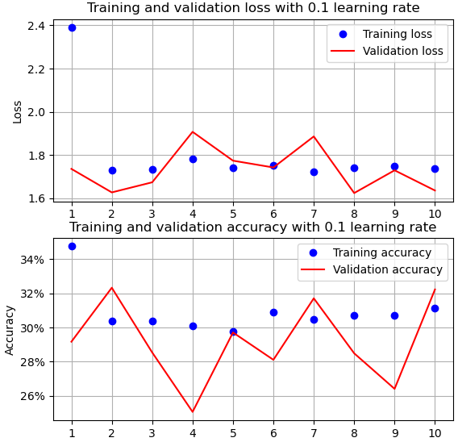

[toc]


# DNN的PyTorch实现

> 超参数

超参数（Hyperparameters）是机器学习模型训练过程中的一种参数，它们不能通过训练数据直接学习，而是在训练前人为设定的。超参数通常用于控制模型的训练过程和性能，例如学习率、正则化参数、树的深度、神经网络的层数和节点数等。与超参数相对的是模型参数（Model Parameters），模型参数是通过训练数据学习得到的，例如神经网络中的权重和偏置。调整超参数可以影响模型的性能和泛化能力，因此超参数调优是机器学习中一个重要的任务。

> Fashion-MINIST数据集

Fashion-MNIST 数据集是一个常用的图像分类数据集，用于机器学习和深度学习的实验和基准测试。该数据集由 Zalando Research 创建，包含了 10 个类别的灰度图像，每个类别有 6000 个训练样本和 1000 个测试样本，共计 70000 个图像样本。Fashion-MNIST 数据集的每个图像都是 28x28 像素的灰度图像，涵盖了如 T恤、裤子、衬衫等服装类别。

Fashion-MNIST 数据集的出现是为了取代经典的 MNIST 数据集，因为 MNIST 数据集的简单性和过于基础的特点逐渐使其失去了对模型性能的真实评估能力。Fashion-MNIST 数据集旨在提供一个更具挑战性的替代品，但仍然保留了与 MNIST 相似的数据格式和任务。


## 1.Fashion-MINIST数据集

导入了PyTorch的`torchvision`模块中的`datasets`类，该类包含了一些常用的数据集，包括FashionMNIST

```python
from torchvision import datasets
import torch
import matplotlib.pyplot as plt
import numpy as np

data_folder = '~/data/FMNIST'  # This can be any directory you want
# to download FMNIST to
fmnist = datasets.FashionMNIST(data_folder, download=True, train=True)

tr_images = fmnist.data
tr_targets = fmnist.targets

unique_values = tr_targets.unique()
print(f'tr_images & tr_targets:\n\t'
      f'X - {tr_images.shape}\n\tY - {tr_targets.shape}\n\t'
      f'Y - Unique Values : {unique_values}')
print(f'TASK:\n\t{len(unique_values)} class Classification')
print(f'UNIQUE CLASSES:\n\t{fmnist.classes}')

R, C = len(tr_targets.unique()), 10
# 创建一个具有R行和C列的子图网格
fig, ax = plt.subplots(R, C, figsize=(10, 10))
# 遍历每个子图行
for label_class, plot_row in enumerate(ax):
    # 获取标签等于当前类别的图像索引
    label_x_rows = np.where(tr_targets == label_class)[0]
    # 遍历当前行的每个子图
    for plot_cell in plot_row:
        plot_cell.grid(False);
        plot_cell.axis('off')
        # 从列表中随机选择一个元素
        ix = np.random.choice(label_x_rows)
        x, y = tr_images[ix], tr_targets[ix]
        plot_cell.imshow(x, cmap='gray')
# 调整子图的布局，使其紧凑显示
plt.tight_layout()
plt.show()

'''
tr_images & tr_targets:
	X - torch.Size([60000, 28, 28])
	Y - torch.Size([60000])
	Y - Unique Values : tensor([0, 1, 2, 3, 4, 5, 6, 7, 8, 9])
TASK:
	10 class Classification
UNIQUE CLASSES:
	['T-shirt/top', 'Trouser', 'Pullover', 'Dress', 'Coat', 'Sandal', 'Shirt', 'Sneaker', 'Bag', 'Ankle boot']
'''
```

- 使用`datasets.FashionMNIST`类来加载FashionMNIST数据集。`download=True`表示如果数据集不存在，则下载它，`train=True`表示加载训练集。

- 将数据集中的图像数据赋值给变量`tr_images`。将数据集中的标签赋值给变量`tr_targets`。
- `unique_values = tr_targets.unique()`: 找到标签中的唯一值。

`plt.subplots()`函数返回一个包含图形和子图对象的元组。`fig`是整个图形的对象，`ax`是一个数组，包含了子图对象。

 `np.where()` 函数用于根据给定的条件返回输入数组中满足条件的**元素的索引**

```python
numpy.where(condition, x, y) # 如果满足条件，结果数组取x中对应位置的值，否则取y中对应位置的值

x = np.array([1, 2, 3, 4, 5])
y = np.array([-1, -2, -3, -4, -5])
result = np.where(x > 2, x, y)
print(result) # [-1 -2  3  4  5]

numpy.where(condition) # 返回满足条件的元素的索引
arr = np.array([1, 2, 3, 4, 5])
indices = np.where(arr > 2)
print(indices) # (array([2, 3, 4], dtype=int64),)

arr = np.array([[1, 2, 3], [4, 5, 6], [7, 8, 9]])
indices = np.where(arr > 5)
print(indices) # (array([1, 2, 2, 2], dtype=int64), array([2, 0, 1, 2], dtype=int64))
'''
由于数组arr是二维的，因此np.where()函数会返回一个包含两个数组的元组，第一个数组包含满足条件的元素的行索引，第二个数组包含满足条件的元素的列索引。
'''
```

注意上面的 `np.where` 即使对一维的ndarray数组，返回的也是只包含一个元素的元组，这里的元素是满足条件的元素的索引的ndarray数组。这便不难体会下面代码的意思：

```python
label_x_rows = np.where(tr_targets == 0)
print(label_x_rows)
label_x_rows = np.where(tr_targets == 0)[0]
print(label_x_rows)
'''
(array([    1,     2,     4, ..., 59974, 59985, 59998], dtype=int64),)
[    1     2     4 ... 59974 59985 59998]
'''
```


## 2.训练神经网络

### 2.1损失未减小-准确度不高

加载数据集，生成训练数据的加载器：

```python
device = "cuda" if torch.cuda.is_available() else "cpu"
data_folder = '~/data/FMNIST'  # This can be any directory you want to
# download FMNIST to
fmnist = datasets.FashionMNIST(data_folder, download=True, train=True)
tr_images = fmnist.data
tr_targets = fmnist.targets

unique_values = tr_targets.unique()

print(tr_images.shape)
print(tr_targets.shape)
print(unique_values)


# 构建获取数据集的类
class FMNISTDataset(Dataset):
    def __init__(self, x, y):
        x = x.float()
        x = x.view(-1, 28 * 28)
        self.x, self.y = x, y

    def __getitem__(self, ix):
        x, y = self.x[ix], self.y[ix]
        return x.to(device), y.to(device)

    def __len__(self):
        return len(self.x)


# 返回训练数据的加载器
def get_data():
    train = FMNISTDataset(tr_images, tr_targets)
    trn_dl = DataLoader(train, batch_size=32, shuffle=True)
    return trn_dl


# 加载器的使用
for i, data in enumerate(get_data()):
    x, y = data
    if i == 0:
        print(i, x.shape, y.shape, len(y))
    else:
        break
'''
torch.Size([60000, 28, 28])
torch.Size([60000])
tensor([0, 1, 2, 3, 4, 5, 6, 7, 8, 9])
0 torch.Size([32, 784]) torch.Size([32]) 32
'''
```

- `x.view(*shape)` ：`shape`: 一个包含了新形状的元组。其中，-1 表示该维度的大小将根据其他维度的大小自动推断。`x.view(-1, 28 * 28)` 的作用是将 `x` 转换为一个二维张量，行数为自动推断出来的（-1），列数为 28 * 28（即图像的像素数量）。

数据加载器中每次迭代返回的x是包含32个图像（28x28）的数据，所以是形状为 `(32,784)` 

定义模型、损失函数和优化器：

```python
# 定义一个模型 损失函数 优化器
from torch.optim import SGD
def get_model():
    model = nn.Sequential(
        nn.Linear(28 * 28, 1000),
        nn.ReLU(),
        nn.Linear(1000, 10)
    ).to(device)
    loss_fn = nn.CrossEntropyLoss()
    optimizer = SGD(model.parameters(), lr=1e-2)
    return model, loss_fn, optimizer
```

在一个批次上进行训练：

```python
def train_batch(x, y, model, opt, loss_fn):
    model.train()  # <- let's hold on to this until we reach dropout section
    # call your model like any python function on your batch of inputs
    prediction = model(x)
    # compute loss
    batch_loss = loss_fn(prediction, y)
    # based on the forward pass in `model(x)` compute all the gradients of
    # 'model.parameters()'
    batch_loss.backward()
    # apply new-weights = f(old-weights, old-weight-gradients) where
    # "f" is the optimizer
    opt.step()
    # Flush gradients memory for next batch of calculations
    opt.zero_grad()
    return batch_loss.item()
```

精度函数：

```python
def accuracy(x, y, model):
    with torch.no_grad():
        model.eval()  # <- let's wait till we get to dropout section
        # get the prediction matrix for a tensor of `x` images
        prediction = model(x)
        # compute if the location of maximum in each row coincides
        # with ground truth
        max_values, argmaxes = prediction.max(-1)
        is_correct = argmaxes == y
        return is_correct.cpu().numpy().tolist()
```

- `torch.no_grad()` 是一个上下文管理器，用于关闭 PyTorch 的梯度跟踪，这样可以节省内存和加快计算速度。在这个上下文中，不会对任何操作进行梯度追踪或梯度计算。

- `model.eval()` 是 PyTorch 模型的方法，用于将模型切换到评估模式。在评估模式下，通常会禁用一些特定于训练的操作，比如 dropout。

关于 `tensor.max` 的用法：

```python
import torch

tensor = torch.tensor([[1, 12, 3], [4, 5, 6]])

# 在第一个维度上找到最大值及其索引
max_values, indices = tensor.max(dim=0)
print("最大值:", max_values)
print("最大值索引:", indices)

# 在第二个维度上找到最大值及其索引
max_values, indices = tensor.max(dim=1)
print("最大值:", max_values)
print("最大值索引:", indices)
'''
最大值: tensor([ 4, 12,  6])
最大值索引: tensor([1, 0, 1])
最大值: tensor([12,  6])
最大值索引: tensor([1, 2])
'''
```

- `-1` 表示在最后一个维度上找最大值，对于分类问题来说，通常最后一个维度表示类别维度。`max_values` 是最大值组成的张量，`argmaxes` 是对应的索引组成的张量。

- `is_correct` 是一个 PyTorch 张量，通过 `.cpu()` 方法将其移动到 CPU 上，并使用 `.numpy()` 方法将其转换为 NumPy 数组，最后使用 `.tolist()` 方法将其转换为 Python 列表。

进行训练：

```python
trn_dl = get_data()
model, loss_fn, optimizer = get_model()
losses, accuracies = [], []
for epoch in range(5):
    print(epoch)
    epoch_losses, epoch_accuracies = [], []
    for ix, batch in enumerate(iter(trn_dl)):
        x, y = batch
        batch_loss = train_batch(x, y, model, optimizer, loss_fn)
        epoch_losses.append(batch_loss)
        is_correct = accuracy(x, y, model)
        epoch_accuracies.extend(is_correct)
    epoch_loss = np.array(epoch_losses).mean()
    epoch_accuracy = np.mean(epoch_accuracies)
    losses.append(epoch_loss)
    accuracies.append(epoch_accuracy)
```

可视化：

```python
epochs = np.arange(5) + 1
plt.figure(figsize=(20, 5)) # 创建了一个图形窗口
plt.subplot(121) # 创建一个子图，将当前图形分割成1行2列，当前选择第1个子图
plt.title('Loss value')
plt.plot(epochs, losses, label='Training Loss')
plt.legend()
plt.subplot(122) # 创建第2个子图，同样将图形分割成1行2列，当前选择第2个子图。
plt.title('Accuracy value')
plt.plot(epochs, accuracies, label='Training Accuracy')
plt.gca().set_yticklabels(['{:.1f}%'.format(x * 100) for x in plt.gca().get_yticks()])
plt.legend()
plt.show()
```

一个可能输出如下：


损失值并没有随着轮数的增加而显著减少，所以无论等待多久模型都不太可能提供比较高的精确度。这就要求理解我们所使用的各种超参数是如何影响神经网络的准确度的。


### 2.2缩放数据集提高准确度

缩放数据集确保变量被限制在某个有限范围内。下面将每个输入值除以数据集中可能得最大值，将自变量的值限制在0-1之间。

修改获取数据的代码：将输入除以255

```python
class FMNISTDataset(Dataset):
    def __init__(self, x, y):
        x = x.float() / 255
        x = x.view(-1, 28 * 28)
        self.x, self.y = x, y

    def __getitem__(self, ix):
        x, y = self.x[ix], self.y[ix]
        return x.to(device), y.to(device)

    def __len__(self):
        return len(self.x)
```


可以看到，训练损失在持续减少，训练精确度在持续增加。**缩放输入数据集，使其被限制在比较小的取值范围，通常有助于获得更好的模型准确度。**


### 2.3批大小的影响

下面重写批大小为32的代码，并将验证集考虑进去。

加载训练集和验证集：

```python
from torchvision import datasets
import torch
import matplotlib.pyplot as plt
import numpy as np
from torch.utils.data import Dataset, DataLoader
import torch.nn as nn

device = "cuda" if torch.cuda.is_available() else "cpu"

data_folder = '~/data/FMNIST'  # This can be any directory you want to
# download FMNIST to
fmnist = datasets.FashionMNIST(data_folder, download=True, train=True)
tr_images = fmnist.data
tr_targets = fmnist.targets

val_fmnist = datasets.FashionMNIST(data_folder, download=True, train=False)
val_images = val_fmnist.data
val_targets = val_fmnist.targets
```

训练集加载器：

```python
# 构建获取数据集的类
class FMNISTDataset(Dataset):
    def __init__(self, x, y):
        x = x.float() / 255
        x = x.view(-1, 28 * 28)
        self.x, self.y = x, y

    def __getitem__(self, ix):
        x, y = self.x[ix], self.y[ix]
        return x.to(device), y.to(device)

    def __len__(self):
        return len(self.x)


# 返回训练数据的加载器
def get_data():
    train = FMNISTDataset(tr_images, tr_targets)
    trn_dl = DataLoader(train, batch_size=32, shuffle=True)
    val = FMNISTDataset(val_images, val_targets)
    val_dl = DataLoader(val, batch_size=len(val_images), shuffle=False)
    return trn_dl, val_dl
```

训练集的批大小为32，

定义模型：

```python
# 定义一个模型 损失函数 优化器
from torch.optim import SGD, Adam


def get_model():
    model = nn.Sequential(
        nn.Linear(28 * 28, 1000),
        nn.ReLU(),
        nn.Linear(1000, 10)
    ).to(device)

    loss_fn = nn.CrossEntropyLoss()
    optimizer = Adam(model.parameters(), lr=1e-2)
    return model, loss_fn, optimizer
```

训练集的损失函数、测试集的损失函数和准确率函数：

```python
def train_batch(x, y, model, opt, loss_fn):
    model.train()
    prediction = model(x)
    batch_loss = loss_fn(prediction, y)
    batch_loss.backward()
    optimizer.step()
    optimizer.zero_grad()
    return batch_loss.item()


def accuracy(x, y, model):
    model.eval()
    with torch.no_grad():
        prediction = model(x)
    max_values, argmaxes = prediction.max(-1)
    is_correct = argmaxes == y
    return is_correct.cpu().numpy().tolist()


def val_loss(x, y, model):
    with torch.no_grad():
        prediction = model(x)
        val_loss = loss_fn(prediction, y)
        return val_loss.item()
```

验证集的损失函数是使用模型进行一次前向传播，然后计算相关的损失。

模型训练：

```python
trn_dl, val_dl = get_data()
model, loss_fn, optimizer = get_model()

train_losses, train_accuracies = [], []
val_losses, val_accuracies = [], []
for epoch in range(5):
    print(epoch)

    train_epoch_losses, train_epoch_accuracies = [], []
    for ix, batch in enumerate(iter(trn_dl)):
        x, y = batch
        batch_loss = train_batch(x, y, model, optimizer, loss_fn)
        train_epoch_losses.append(batch_loss)
        is_correct = accuracy(x, y, model)
        train_epoch_accuracies.extend(is_correct)
    train_epoch_loss = np.array(train_epoch_losses).mean()
    train_epoch_accuracy = np.mean(train_epoch_accuracies)
    train_losses.append(train_epoch_loss)
    train_accuracies.append(train_epoch_accuracy)

    for ix, batch in enumerate(iter(val_dl)):
        x, y = batch
        val_is_correct = accuracy(x, y, model)
        validation_loss = val_loss(x, y, model)
    val_epoch_accuracy = np.mean(val_is_correct)
    val_losses.append(validation_loss)
    val_accuracies.append(val_epoch_accuracy)
```

可视化输出：

```python
epochs = np.arange(5) + 1
import matplotlib.ticker as mticker

plt.subplot(211)
plt.plot(epochs, train_losses, 'bo', label='Training loss')
plt.plot(epochs, val_losses, 'r', label='Validation loss')
plt.gca().xaxis.set_major_locator(mticker.MultipleLocator(1))
plt.title('loss when batch size is 32')
# plt.xlabel('Epochs')
plt.ylabel('Loss')
plt.legend()
plt.grid('off')
# plt.show()
plt.subplot(212)
plt.plot(epochs, train_accuracies, 'bo', label='Training accuracy')
plt.plot(epochs, val_accuracies, 'r', label='Validation accuracy')
plt.gca().xaxis.set_major_locator(mticker.MultipleLocator(1))
plt.title('accuracy when batch size is 32')
# plt.xlabel('Epochs')
plt.ylabel('Accuracy')
plt.gca().set_yticklabels(['{:.0f}%'.format(x * 100) for x in plt.gca().get_yticks()])
plt.legend()
plt.grid('off')
plt.show()
```

-  `plt.gca().xaxis.set_major_locator` 设置了x轴主刻度的位置，使用了`set_major_locator()`方法。在这里，`mticker.MultipleLocator(1)`表示每隔1个epoch设置一个主刻度。


蓝色点表示训练集的损失和精度，可以看到损失减少、精度增加。而训练集在波动。

---

改变批大小为1000：

```python
def get_data():
    train = FMNISTDataset(tr_images, tr_targets)
    trn_dl = DataLoader(train, batch_size=1000, shuffle=True)
    val = FMNISTDataset(val_images, val_targets)
    val_dl = DataLoader(val, batch_size=len(val_images), shuffle=False)
    return trn_dl, val_dl
```


增加批大小到10000：


可以观察到，随着批次的增大，训练集和测试集的损失值都会增加，准确率将会降低。当轮数较少时，较小的批大小通常有助于达到最佳准确率，

较大的批大小可以加快训练速度提高计算效率，但需要更多的内存，可能会导致训练过程更加稳定，因为每个梯度更新的方差更小。较大的批大小可能会增加模型陷入局部最小值的风险，因为在每个梯度更新步骤中，模型更容易受到较大批次中的样本的影响。通常情况下，较大的批大小可以加快模型的收敛速度。这是因为每个批次中包含更多的样本，模型可以更快地从数据中学习到更多的信息，并更新权重。

较小的批大小可能会导致训练不稳定，因为每个批次的梯度估计可能会受到更大的随机性影响。


### 2.4损失优化器影响

在批大小为32下，观察不同的优化器对训练的影响。

使用SGD优化器，并增加训练的轮数为10

```python
def get_model():
    model = nn.Sequential(
        nn.Linear(28 * 28, 1000),
        nn.ReLU(),
        nn.Linear(1000, 10)
    ).to(device)

    loss_fn = nn.CrossEntropyLoss()
    optimizer = SGD(model.parameters(), lr=1e-2)
    return model, loss_fn, optimizer
```

可视化输出：

```python
epochs = np.arange(10) + 1
import matplotlib.ticker as mticker

plt.subplot(211)
plt.plot(epochs, train_losses, 'bo', label='Training loss')
plt.plot(epochs, val_losses, 'r', label='Validation loss')
plt.gca().xaxis.set_major_locator(mticker.MultipleLocator(1))
plt.title('Training and validation loss with SGD optimizer')
# plt.xlabel('Epochs')
plt.ylabel('Loss')
plt.legend()
plt.grid('off')
# plt.show()
plt.subplot(212)
plt.plot(epochs, train_accuracies, 'bo', label='Training accuracy')
plt.plot(epochs, val_accuracies, 'r', label='Validation accuracy')
plt.gca().xaxis.set_major_locator(mticker.MultipleLocator(1))
plt.title('Training and validation accuracy with SGD optimizer')
# plt.xlabel('Epochs')
plt.ylabel('Accuracy')
plt.gca().set_yticklabels(['{:.0f}%'.format(x * 100) for x in plt.gca().get_yticks()])
plt.legend()
plt.grid('off')
plt.show()
```


换为使用Adam优化器：


区别

在更新规则上：

- SGD：每次更新权重时，都会按照梯度方向在整个训练集上进行一次更新。
- Adam：结合了动量（momentum）和自适应学习率的概念，根据梯度的一阶矩估计（mean）和二阶矩估计（variance）来调整每个参数的学习率。

学习率调整：

- SGD：通常需要手动设置全局学习率，并且在训练过程中可能需要逐步调整学习率。
- Adam：具有自适应学习率，不需要手动设置全局学习率，可以根据每个参数的梯度情况自动调整学习率。

动量：

- SGD：可以手动添加动量来加速收敛，但需要额外设置动量参数。
- Adam：自动结合了动量，不需要额外设置动量参数。

1.Adam通常能够比SGD更快地收敛，Adam相对于SGD更加稳定，因为它可以自适应地调整学习率，并且能够处理不同参数的梯度变化情况。

2.Adam在某些情况下可能会导致模型过拟合，特别是在训练集较小或数据噪声较大的情况下。因为Adam能够更快地收敛，可能会导致模型在训练集上表现很好，但在测试集上泛化能力较差。


### 2.5学习率影响

讨论下面的情形：

- 在缩放数据集上测试学习率影响
- 在非缩放数据集上测试学习率影响

---

在缩放数据集上：

```python
class FMNISTDataset(Dataset):
    def __init__(self, x, y):
        x = x.float() / 255
        x = x.view(-1, 28 * 28)
        self.x, self.y = x, y

    def __getitem__(self, ix):
        x, y = self.x[ix], self.y[ix]
        return x.to(device), y.to(device)

    def __len__(self):
        return len(self.x)
```

调整学习率：

```python
def get_model():
    model = nn.Sequential(
        nn.Linear(28 * 28, 1000),
        nn.ReLU(),
        nn.Linear(1000, 10)
    ).to(device)

    loss_fn = nn.CrossEntropyLoss()
    optimizer = Adam(model.parameters(), lr=1e-1)
    return model, loss_fn, optimizer
```

将学习率 `lr` 依次改为0.1、0.001、0.00001，轮数变为10，观察到结果：




不能拉伸图像，，，拉伸以后0.00001的准确度会大于1。

总结：

学习率较小时，训练损失和验证损失之间的差距较小，模型学习速度更慢。

---

下面是学习率对各层参数的影响，有以下四组参数：

- 输入到隐藏层权重
- 隐藏层偏置
- 隐藏到输出层权重
- 输出层偏置

```python
for ix, par in enumerate(model.parameters()):
    if (ix == 0):
        plt.subplot(221)
        plt.hist(par.cpu().detach().numpy().flatten())
        plt.title('weights input to hidden layer')
        # plt.show()
    elif (ix == 1):
        plt.subplot(222)
        plt.hist(par.cpu().detach().numpy().flatten())
        plt.title('biases of hidden layer')
        # plt.show()
    elif (ix == 2):
        plt.subplot(223)
        plt.hist(par.cpu().detach().numpy().flatten())
        plt.title('weights hidden to output layer')
        # plt.show()
    elif (ix == 3):
        plt.subplot(224)
        plt.hist(par.cpu().detach().numpy().flatten())
        plt.title('biases of output layer')
        # plt.show()
plt.show()
```

在三个学习率上，四组参数分布如下：


可以观察到：

学习率较大时，参数分布更大，这里的分布也就是参数的取值范围更大。

---

下面是学习率对非缩放数据集的影响：


拥有较大学习率都不太可能产生最好的效果，下面将介绍在模型开始出现过拟合时自动降低学习率。


### 2.6学习率调度器

```python
from torch import optim

scheduler = optim.lr_scheduler.ReduceLROnPlateau(optimizer, factor=0.5, patience=0, threshold=0.001, verbose=True, min_lr=1e-5, threshold_mode='abs')
```

自动调整学习率，但是实验没做成功， `verbose` 参数被废弃不显示学习率更新。

书本上实验结果：


每当验证损失随着轮数的增加而增加至少0.001时，学习率就会减半，这发生在5、8...轮。


### 2.7网络层数的影响

增加网络层数：

```python
def get_model():
    model = nn.Sequential(
        nn.Linear(28 * 28, 1000),
        nn.ReLU(),
        nn.Linear(1000, 1000),
        nn.ReLU(),
        nn.Linear(1000, 10)
    ).to(device)

    loss_fn = nn.CrossEntropyLoss()
    optimizer = Adam(model.parameters(), lr=1e-3)
    return model, loss_fn, optimizer
```


两层隐藏层模型的过拟合量会大于一层隐藏层模型的过拟合量。

下面学习如何在中间层中处理未缩放的数据。


### 2.8批归一化的影响

Batch Normalization

对于输入值既不能太小也不能太大，使用批归一化解决：

批均值：
$$
\mu_B = \frac{1}{m} \sum_{i=1}^{m} x_i
$$
批方差：
$$
\sigma_2^B = \frac{1}{m} \sum_{i=1}^{m} (x_i - \mu_B)^2
$$
归一化输入：
$$
\bar{x_{i}} = \frac{(x_i - \mu_B)}{\sqrt{\sigma_B^2} + \epsilon}
$$
批归一化输入：
$$
\gamma \bar{x_{i}} + \beta
$$

---

没有批归一化非常小的输入值：

将输入进一步缩放到0-0.00001：

```python
class FMNISTDataset(Dataset):
    def __init__(self, x, y):
        x = x.float() / (255 * 10000)
        x = x.view(-1, 28 * 28)
        self.x, self.y = x, y

    def __getitem__(self, ix):
        x, y = self.x[ix], self.y[ix]
        return x.to(device), y.to(device)

    def __len__(self):
        return len(self.x)
```

重新定义网络模型，以便获取中间层数据：

```python
def get_model():
    class neuralnet(nn.Module):
        def __init__(self):
            super().__init__()
            self.input_to_hidden_layer = nn.Linear(784, 1000)
            self.hidden_layer_activation = nn.ReLU()
            self.hidden_to_output_layer = nn.Linear(1000, 10)

        def forward(self, x):
            x = self.input_to_hidden_layer(x)
            x1 = self.hidden_layer_activation(x)
            x2 = self.hidden_to_output_layer(x1)
            return x2, x1

    model = neuralnet().to(device)

    loss_fn = nn.CrossEntropyLoss()
    optimizer = Adam(model.parameters(), lr=1e-3)
    return model, loss_fn, optimizer
```

由于模型的前向传播返回了中间层数据和输出层数据，需要重写批训练、准确度以及验证损失函数

```python
def train_batch(x, y, model, opt, loss_fn):
    prediction = model(x)[0]
    batch_loss = loss_fn(prediction, y)
    batch_loss.backward()
    opt.step()
    opt.zero_grad()
    return batch_loss.item()


def accuracy(x, y, model):
    model.eval()
    with torch.no_grad():
        prediction = model(x)[0]
    max_values, argmaxes = prediction.max(-1)
    is_correct = argmaxes == y
    return is_correct.cpu().numpy().tolist()


def val_loss(x, y, model):
    model.eval()
    with torch.no_grad():
        prediction = model(x)[0]
        val_loss = loss_fn(prediction, y)
        return val_loss.item()
```

可视化输出：

```python
epochs = np.arange(100) + 1

import matplotlib.pyplot as plt
import matplotlib.ticker as mticker

plt.subplot(211)
plt.plot(epochs, train_losses, 'bo', label='Training loss')
plt.plot(epochs, val_losses, 'r', label='Validation loss')
plt.gca().xaxis.set_major_locator(mticker.MultipleLocator(1))
plt.title('loss with very small input values')
# plt.xlabel('Epochs')
plt.ylabel('Loss')
plt.legend()
plt.grid('off')
# plt.show()
plt.subplot(212)
plt.plot(epochs, train_accuracies, 'bo', label='Training accuracy')
plt.plot(epochs, val_accuracies, 'r', label='Validation accuracy')
plt.gca().xaxis.set_major_locator(mticker.MultipleLocator(1))
plt.title('accuracy with very small input values')
# plt.xlabel('Epochs')
plt.ylabel('Accuracy')
plt.gca().set_yticklabels(['{:.0f}%'.format(x * 100) for x in plt.gca().get_yticks()])
plt.legend()
plt.grid('off')
plt.show()

plt.hist(model(x)[1].cpu().detach().numpy().flatten())
plt.title("Hidden layer node values' distribution")
plt.show()

for ix, par in enumerate(model.parameters()):
    if (ix == 0):
        plt.subplot(221)
        plt.hist(par.cpu().detach().numpy().flatten())
        plt.title('weights input to hidden layer')
        # plt.show()
    elif (ix == 1):
        plt.subplot(222)
        plt.hist(par.cpu().detach().numpy().flatten())
        plt.title('biases of hidden layer')
        # plt.show()
    elif (ix == 2):
        plt.subplot(223)
        plt.hist(par.cpu().detach().numpy().flatten())
        plt.title('weights hidden to output layer')
        # plt.show()
    elif (ix == 3):
        plt.subplot(224)
        plt.hist(par.cpu().detach().numpy().flatten())
        plt.title('biases of output layer')
        # plt.show()
plt.show()
```

损失和精度变化：


隐藏层节点值分布：


参数分布：


- 100轮之后也未训练好，前面使用10轮训练的模型在验证数据集上的准确率达到90%，而当前的模型只有约85%。

通过考察隐藏层值的分布以及参数的分布来理解为什么当输入值的范围很小时模型不能得到很好的训练。

- 输入层和隐藏层的值的分布很小，此时权重必须要有比较大的取值范围。

---

经过批归一化的非常小的输入值：

使用BN批量归一化、ReLU激活函数

```python
def get_model():
    class neuralnet(nn.Module):
        def __init__(self):
            super().__init__()
            self.input_to_hidden_layer = nn.Linear(784, 1000)
            self.batch_norm = nn.BatchNorm1d(1000)
            self.hidden_layer_activation = nn.ReLU()
            self.hidden_to_output_layer = nn.Linear(1000, 10)

        def forward(self, x):
            x = self.input_to_hidden_layer(x)
            x0 = self.batch_norm(x)
            x1 = self.hidden_layer_activation(x0)
            x2 = self.hidden_to_output_layer(x1)
            return x2, x1

    model = neuralnet().to(device)
    loss_fn = nn.CrossEntropyLoss()
    optimizer = Adam(model.parameters(), lr=1e-3)
    return model, loss_fn, optimizer
```

训练集和验证集的准确率和损失值变化如下：


隐藏层的值分布和权重参数分布如下：


但进行批归一化时，隐藏层值的分布范围较大，而连接隐藏层和输出层的权重的分布范围较小，模型训练的结果和前面一样有效。

批归一可以避免梯度变得太小，以至于不能更新权重。

尽管如此，过拟合的问题还有待解决。


### 2.9使用dropout和正则化减少过拟合

前面我们看到训练集的准确度高达95%，而验证集的准确度却不到90%。表明模型的泛化程度不高，这就是过拟合的情形。

---

添加dropout影响：

dropout只在训练过程中，随机选择特定百分比的隐藏节点关闭，然后下一次迭代再随机选择另一组隐藏单元关闭。预测过程不需要dropout。

使用模型时需要指定模式：训练模式和评估模式

```python
model.train()
model.eval()
```

处于eval模式时，会抑制dropout层并返回相同的输出。

在定义模型架构时，指定dropout：

```python
def get_model():
    model = nn.Sequential(
        nn.Dropout(0.25),
        nn.Linear(28 * 28, 1000),
        nn.ReLU(),
        nn.Dropout(0.25),
        nn.Linear(1000, 10)
    ).to(device)

    loss_fn = nn.CrossEntropyLoss()
    optimizer = Adam(model.parameters(), lr=1e-3)
    return model, loss_fn, optimizer
```


不使用dropout：

```python
def get_model():
    model = nn.Sequential(
        nn.Linear(28 * 28, 1000),
        nn.ReLU(),
        nn.Linear(1000, 10)
    ).to(device)

    loss_fn = nn.CrossEntropyLoss()
    optimizer = Adam(model.parameters(), lr=1e-3)
    return model, loss_fn, optimizer
```


- Dropout在线性激活之前

- 使用dropout之后，训练集和验证集的准确度之间的差别减小，有效降低了过拟合

---

正则化是一种用于对模型中高权重值进行惩罚的技术。它是一种具有双重优化目标的函数，最小化训练数据的损失和权重值。

L1正则化：在损失值的计算过程中纳入权重的绝对值之和，实现对取值较高的权重值的惩罚。

相关代码：

```python
def train_batch(x, y, model, opt, loss_fn):
    prediction = model(x)
    l1_regularization = 0
    for param in model.parameters():
        l1_regularization += torch.norm(param, 1)
    batch_loss = loss_fn(prediction, y) + 0.0001 * l1_regularization
    batch_loss.backward()
    optimizer.step()
    optimizer.zero_grad()
    return batch_loss.item()
```


可以看到模型训练准确度和验证准确度差异没那么大了。

L2正则化：纳入权重值的平方和来惩罚取值较高的权重值

```python
def train_batch(x, y, model, opt, loss_fn):
    prediction = model(x)
    l2_regularization = 0
    for param in model.parameters():
        l2_regularization += torch.norm(param, 2)
    batch_loss = loss_fn(prediction, y) + 0.01 * l2_regularization
    batch_loss.backward()
    optimizer.step()
    optimizer.zero_grad()
    return batch_loss.item()
```


## 完整代码

### 2.1

```python
from torchvision import datasets
import torch
import matplotlib.pyplot as plt
import numpy as np
from torch.utils.data import Dataset, DataLoader
import torch.nn as nn

tensor = torch.tensor([[1, 12, 3], [4, 5, 6]])

device = "cuda" if torch.cuda.is_available() else "cpu"

data_folder = '~/data/FMNIST'  # This can be any directory you want to
# download FMNIST to
fmnist = datasets.FashionMNIST(data_folder, download=True, train=True)
tr_images = fmnist.data
tr_targets = fmnist.targets

unique_values = tr_targets.unique()

print(tr_images.shape)
print(tr_targets.shape)
print(unique_values)


# 构建获取数据集的类
class FMNISTDataset(Dataset):
    def __init__(self, x, y):
        x = x.float()
        x = x.view(-1, 28 * 28)
        self.x, self.y = x, y

    def __getitem__(self, ix):
        x, y = self.x[ix], self.y[ix]
        return x.to(device), y.to(device)

    def __len__(self):
        return len(self.x)


def get_data():
    train = FMNISTDataset(tr_images, tr_targets)
    trn_dl = DataLoader(train, batch_size=32, shuffle=True)
    return trn_dl


from torch.optim import SGD


def get_model():
    model = nn.Sequential(
        nn.Linear(28 * 28, 1000),
        nn.ReLU(),
        nn.Linear(1000, 10)
    ).to(device)
    loss_fn = nn.CrossEntropyLoss()
    optimizer = SGD(model.parameters(), lr=1e-2)
    return model, loss_fn, optimizer


def train_batch(x, y, model, opt, loss_fn):
    model.train()  # <- let's hold on to this until we reach dropout section
    # call your model like any python function on your batch of inputs
    prediction = model(x)
    # compute loss
    batch_loss = loss_fn(prediction, y)
    # based on the forward pass in `model(x)` compute all the gradients of
    # 'model.parameters()'
    batch_loss.backward()
    # apply new-weights = f(old-weights, old-weight-gradients) where
    # "f" is the optimizer
    opt.step()
    # Flush gradients memory for next batch of calculations
    opt.zero_grad()
    return batch_loss.item()


def accuracy(x, y, model):
    with torch.no_grad():
        model.eval()  # <- let's wait till we get to dropout section
        # get the prediction matrix for a tensor of `x` images
        prediction = model(x)
        # compute if the location of maximum in each row coincides
        # with ground truth
        max_values, argmaxes = prediction.max(-1)
        is_correct = argmaxes == y
        return is_correct.cpu().numpy().tolist()


trn_dl = get_data()
model, loss_fn, optimizer = get_model()
losses, accuracies = [], []
for epoch in range(5):
    print(epoch)
    epoch_losses, epoch_accuracies = [], []
    for ix, batch in enumerate(iter(trn_dl)):
        x, y = batch
        batch_loss = train_batch(x, y, model, optimizer, loss_fn)
        epoch_losses.append(batch_loss)
        is_correct = accuracy(x, y, model)
        epoch_accuracies.extend(is_correct)
    epoch_loss = np.array(epoch_losses).mean()
    epoch_accuracy = np.mean(epoch_accuracies)
    losses.append(epoch_loss)
    accuracies.append(epoch_accuracy)

epochs = np.arange(5) + 1
plt.figure(figsize=(20, 5))  # 创建了一个图形窗口
plt.subplot(121)  # 创建一个子图，将当前图形分割成1行2列，当前选择第1个子图
plt.title('Loss value')
plt.plot(epochs, losses, label='Training Loss')
plt.legend()
plt.subplot(122)  # 创建第2个子图，同样将图形分割成1行2列，当前选择第2个子图。
plt.title('Accuracy value')
plt.plot(epochs, accuracies, label='Training Accuracy')
plt.gca().set_yticklabels(['{:.1f}%'.format(x * 100) for x in plt.gca().get_yticks()])
plt.legend()
plt.show()
```


### 2.2 

```python
from torchvision import datasets
import torch
import matplotlib.pyplot as plt
import numpy as np
from torch.utils.data import Dataset, DataLoader
import torch.nn as nn

tensor = torch.tensor([[1, 12, 3], [4, 5, 6]])

device = "cuda" if torch.cuda.is_available() else "cpu"

data_folder = '~/data/FMNIST'  # This can be any directory you want to
# download FMNIST to
fmnist = datasets.FashionMNIST(data_folder, download=True, train=True)
tr_images = fmnist.data
tr_targets = fmnist.targets

unique_values = tr_targets.unique()

print(tr_images.shape)
print(tr_targets.shape)
print(unique_values)


# 构建获取数据集的类
class FMNISTDataset(Dataset):
    def __init__(self, x, y):
        x = x.float() / 255
        x = x.view(-1, 28 * 28)
        self.x, self.y = x, y

    def __getitem__(self, ix):
        x, y = self.x[ix], self.y[ix]
        return x.to(device), y.to(device)

    def __len__(self):
        return len(self.x)


def get_data():
    train = FMNISTDataset(tr_images, tr_targets)
    trn_dl = DataLoader(train, batch_size=32, shuffle=True)
    return trn_dl


from torch.optim import SGD


def get_model():
    model = nn.Sequential(
        nn.Linear(28 * 28, 1000),
        nn.ReLU(),
        nn.Linear(1000, 10)
    ).to(device)
    loss_fn = nn.CrossEntropyLoss()
    optimizer = SGD(model.parameters(), lr=1e-2)
    return model, loss_fn, optimizer


def train_batch(x, y, model, opt, loss_fn):
    model.train()  # <- let's hold on to this until we reach dropout section
    # call your model like any python function on your batch of inputs
    prediction = model(x)
    # compute loss
    batch_loss = loss_fn(prediction, y)
    # based on the forward pass in `model(x)` compute all the gradients of
    # 'model.parameters()'
    batch_loss.backward()
    # apply new-weights = f(old-weights, old-weight-gradients) where
    # "f" is the optimizer
    opt.step()
    # Flush gradients memory for next batch of calculations
    opt.zero_grad()
    return batch_loss.item()


def accuracy(x, y, model):
    with torch.no_grad():
        model.eval()  # <- let's wait till we get to dropout section
        # get the prediction matrix for a tensor of `x` images
        prediction = model(x)
        # compute if the location of maximum in each row coincides
        # with ground truth
        max_values, argmaxes = prediction.max(-1)
        is_correct = argmaxes == y
        return is_correct.cpu().numpy().tolist()


trn_dl = get_data()
model, loss_fn, optimizer = get_model()
losses, accuracies = [], []
for epoch in range(5):
    print(epoch)
    epoch_losses, epoch_accuracies = [], []
    for ix, batch in enumerate(iter(trn_dl)):
        x, y = batch
        batch_loss = train_batch(x, y, model, optimizer, loss_fn)
        epoch_losses.append(batch_loss)
        is_correct = accuracy(x, y, model)
        epoch_accuracies.extend(is_correct)
    epoch_loss = np.array(epoch_losses).mean()
    epoch_accuracy = np.mean(epoch_accuracies)
    losses.append(epoch_loss)
    accuracies.append(epoch_accuracy)

epochs = np.arange(5) + 1
plt.figure(figsize=(20, 5))  # 创建了一个图形窗口
plt.subplot(121)  # 创建一个子图，将当前图形分割成1行2列，当前选择第1个子图
plt.title('Loss value')
plt.plot(epochs, losses, label='Training Loss')
plt.legend()
plt.subplot(122)  # 创建第2个子图，同样将图形分割成1行2列，当前选择第2个子图。
plt.title('Accuracy value')
plt.plot(epochs, accuracies, label='Training Accuracy')
plt.gca().set_yticklabels(['{:.1f}%'.format(x * 100) for x in plt.gca().get_yticks()])
plt.legend()
plt.show()
```


### 2.3

```python
from torchvision import datasets
import torch
import matplotlib.pyplot as plt
import numpy as np
from torch.utils.data import Dataset, DataLoader
import torch.nn as nn

device = "cuda" if torch.cuda.is_available() else "cpu"

data_folder = '~/data/FMNIST'  # This can be any directory you want to
# download FMNIST to
fmnist = datasets.FashionMNIST(data_folder, download=True, train=True)
tr_images = fmnist.data
tr_targets = fmnist.targets

val_fmnist = datasets.FashionMNIST(data_folder, download=True, train=False)
val_images = val_fmnist.data
val_targets = val_fmnist.targets


# 构建获取数据集的类
class FMNISTDataset(Dataset):
    def __init__(self, x, y):
        x = x.float() / 255
        x = x.view(-1, 28 * 28)
        self.x, self.y = x, y

    def __getitem__(self, ix):
        x, y = self.x[ix], self.y[ix]
        return x.to(device), y.to(device)

    def __len__(self):
        return len(self.x)


# 返回训练数据的加载器
def get_data():
    train = FMNISTDataset(tr_images, tr_targets)
    trn_dl = DataLoader(train, batch_size=10000, shuffle=True)
    val = FMNISTDataset(val_images, val_targets)
    val_dl = DataLoader(val, batch_size=len(val_images), shuffle=False)
    return trn_dl, val_dl


# 定义一个模型 损失函数 优化器
from torch.optim import SGD, Adam


def get_model():
    model = nn.Sequential(
        nn.Linear(28 * 28, 1000),
        nn.ReLU(),
        nn.Linear(1000, 10)
    ).to(device)

    loss_fn = nn.CrossEntropyLoss()
    optimizer = Adam(model.parameters(), lr=1e-2)
    return model, loss_fn, optimizer


def train_batch(x, y, model, opt, loss_fn):
    model.train()
    prediction = model(x)
    batch_loss = loss_fn(prediction, y)
    batch_loss.backward()
    optimizer.step()
    optimizer.zero_grad()
    return batch_loss.item()


def accuracy(x, y, model):
    model.eval()
    with torch.no_grad():
        prediction = model(x)
    max_values, argmaxes = prediction.max(-1)
    is_correct = argmaxes == y
    return is_correct.cpu().numpy().tolist()


def val_loss(x, y, model):
    with torch.no_grad():
        prediction = model(x)
        val_loss = loss_fn(prediction, y)
        return val_loss.item()


trn_dl, val_dl = get_data()
model, loss_fn, optimizer = get_model()

train_losses, train_accuracies = [], []
val_losses, val_accuracies = [], []
for epoch in range(5):
    print(epoch)

    train_epoch_losses, train_epoch_accuracies = [], []
    for ix, batch in enumerate(iter(trn_dl)):
        x, y = batch
        batch_loss = train_batch(x, y, model, optimizer, loss_fn)
        train_epoch_losses.append(batch_loss)
        is_correct = accuracy(x, y, model)
        train_epoch_accuracies.extend(is_correct)
    train_epoch_loss = np.array(train_epoch_losses).mean()
    train_epoch_accuracy = np.mean(train_epoch_accuracies)
    train_losses.append(train_epoch_loss)
    train_accuracies.append(train_epoch_accuracy)

    for ix, batch in enumerate(iter(val_dl)):
        x, y = batch
        val_is_correct = accuracy(x, y, model)
        validation_loss = val_loss(x, y, model)
    val_epoch_accuracy = np.mean(val_is_correct)
    val_losses.append(validation_loss)
    val_accuracies.append(val_epoch_accuracy)

epochs = np.arange(5) + 1
import matplotlib.ticker as mticker

plt.subplot(211)
plt.plot(epochs, train_losses, 'bo', label='Training loss')
plt.plot(epochs, val_losses, 'r', label='Validation loss')
plt.gca().xaxis.set_major_locator(mticker.MultipleLocator(1))
plt.title('loss when batch size is 10000')
# plt.xlabel('Epochs')
plt.ylabel('Loss')
plt.legend()
plt.grid('off')
# plt.show()
plt.subplot(212)
plt.plot(epochs, train_accuracies, 'bo', label='Training accuracy')
plt.plot(epochs, val_accuracies, 'r', label='Validation accuracy')
plt.gca().xaxis.set_major_locator(mticker.MultipleLocator(1))
plt.title('accuracy when batch size is 10000')
# plt.xlabel('Epochs')
plt.ylabel('Accuracy')
plt.gca().set_yticklabels(['{:.0f}%'.format(x * 100) for x in plt.gca().get_yticks()])
plt.legend()
plt.grid('off')
plt.show()
```

修改批大小查看批大小的影响。


### 2.4

```python
from torchvision import datasets
import torch
import matplotlib.pyplot as plt
import numpy as np
from torch.utils.data import Dataset, DataLoader
import torch.nn as nn

device = "cuda" if torch.cuda.is_available() else "cpu"

data_folder = '~/data/FMNIST'  # This can be any directory you want to
# download FMNIST to
fmnist = datasets.FashionMNIST(data_folder, download=True, train=True)
tr_images = fmnist.data
tr_targets = fmnist.targets

val_fmnist = datasets.FashionMNIST(data_folder, download=True, train=False)
val_images = val_fmnist.data
val_targets = val_fmnist.targets


# 构建获取数据集的类
class FMNISTDataset(Dataset):
    def __init__(self, x, y):
        x = x.float() / 255
        x = x.view(-1, 28 * 28)
        self.x, self.y = x, y

    def __getitem__(self, ix):
        x, y = self.x[ix], self.y[ix]
        return x.to(device), y.to(device)

    def __len__(self):
        return len(self.x)


# 返回训练数据的加载器
def get_data():
    train = FMNISTDataset(tr_images, tr_targets)
    trn_dl = DataLoader(train, batch_size=32, shuffle=True)
    val = FMNISTDataset(val_images, val_targets)
    val_dl = DataLoader(val, batch_size=len(val_images), shuffle=False)
    return trn_dl, val_dl


# 定义一个模型 损失函数 优化器
from torch.optim import SGD, Adam


def get_model():
    model = nn.Sequential(
        nn.Linear(28 * 28, 1000),
        nn.ReLU(),
        nn.Linear(1000, 10)
    ).to(device)

    loss_fn = nn.CrossEntropyLoss()
    optimizer = Adam(model.parameters(), lr=1e-2)
    return model, loss_fn, optimizer


def train_batch(x, y, model, opt, loss_fn):
    model.train()
    prediction = model(x)
    batch_loss = loss_fn(prediction, y)
    batch_loss.backward()
    optimizer.step()
    optimizer.zero_grad()
    return batch_loss.item()


def accuracy(x, y, model):
    model.eval()
    with torch.no_grad():
        prediction = model(x)
    max_values, argmaxes = prediction.max(-1)
    is_correct = argmaxes == y
    return is_correct.cpu().numpy().tolist()


def val_loss(x, y, model):
    with torch.no_grad():
        prediction = model(x)
        val_loss = loss_fn(prediction, y)
        return val_loss.item()


trn_dl, val_dl = get_data()
model, loss_fn, optimizer = get_model()

train_losses, train_accuracies = [], []
val_losses, val_accuracies = [], []
for epoch in range(10):
    print(epoch)

    train_epoch_losses, train_epoch_accuracies = [], []
    for ix, batch in enumerate(iter(trn_dl)):
        x, y = batch
        batch_loss = train_batch(x, y, model, optimizer, loss_fn)
        train_epoch_losses.append(batch_loss)
        is_correct = accuracy(x, y, model)
        train_epoch_accuracies.extend(is_correct)
    train_epoch_loss = np.array(train_epoch_losses).mean()
    train_epoch_accuracy = np.mean(train_epoch_accuracies)
    train_losses.append(train_epoch_loss)
    train_accuracies.append(train_epoch_accuracy)

    for ix, batch in enumerate(iter(val_dl)):
        x, y = batch
        val_is_correct = accuracy(x, y, model)
        validation_loss = val_loss(x, y, model)
    val_epoch_accuracy = np.mean(val_is_correct)
    val_losses.append(validation_loss)
    val_accuracies.append(val_epoch_accuracy)

epochs = np.arange(10) + 1
import matplotlib.ticker as mticker

plt.subplot(211)
plt.plot(epochs, train_losses, 'bo', label='Training loss')
plt.plot(epochs, val_losses, 'r', label='Validation loss')
plt.gca().xaxis.set_major_locator(mticker.MultipleLocator(1))
plt.title('Training and validation loss with Adam optimizer')
# plt.xlabel('Epochs')
plt.ylabel('Loss')
plt.legend()
plt.grid('off')
# plt.show()
plt.subplot(212)
plt.plot(epochs, train_accuracies, 'bo', label='Training accuracy')
plt.plot(epochs, val_accuracies, 'r', label='Validation accuracy')
plt.gca().xaxis.set_major_locator(mticker.MultipleLocator(1))
plt.title('Training and validation accuracy with Adam optimizer')
# plt.xlabel('Epochs')
plt.ylabel('Accuracy')
plt.gca().set_yticklabels(['{:.0f}%'.format(x * 100) for x in plt.gca().get_yticks()])
plt.legend()
plt.grid('off')
plt.show()
```

修改优化器为SGD或Adam。


### 2.5

```python
from torchvision import datasets
import torch
import matplotlib.pyplot as plt
import numpy as np
from torch.utils.data import Dataset, DataLoader
import torch.nn as nn

device = "cuda" if torch.cuda.is_available() else "cpu"

data_folder = '~/data/FMNIST'  # This can be any directory you want to
# download FMNIST to
fmnist = datasets.FashionMNIST(data_folder, download=True, train=True)
tr_images = fmnist.data
tr_targets = fmnist.targets

val_fmnist = datasets.FashionMNIST(data_folder, download=True, train=False)
val_images = val_fmnist.data
val_targets = val_fmnist.targets


# 构建获取数据集的类
class FMNISTDataset(Dataset):
    def __init__(self, x, y):
        x = x.float() / 255
        x = x.view(-1, 28 * 28)
        self.x, self.y = x, y

    def __getitem__(self, ix):
        x, y = self.x[ix], self.y[ix]
        return x.to(device), y.to(device)

    def __len__(self):
        return len(self.x)


# 返回训练数据的加载器
def get_data():
    train = FMNISTDataset(tr_images, tr_targets)
    trn_dl = DataLoader(train, batch_size=32, shuffle=True)
    val = FMNISTDataset(val_images, val_targets)
    val_dl = DataLoader(val, batch_size=len(val_images), shuffle=False)
    return trn_dl, val_dl


# 定义一个模型 损失函数 优化器
from torch.optim import SGD, Adam


def get_model():
    model = nn.Sequential(
        nn.Linear(28 * 28, 1000),
        nn.ReLU(),
        nn.Linear(1000, 10)
    ).to(device)

    loss_fn = nn.CrossEntropyLoss()
    optimizer = Adam(model.parameters(), lr=1e-1)
    return model, loss_fn, optimizer


def train_batch(x, y, model, opt, loss_fn):
    model.train()
    prediction = model(x)
    batch_loss = loss_fn(prediction, y)
    batch_loss.backward()
    optimizer.step()
    optimizer.zero_grad()
    return batch_loss.item()


def accuracy(x, y, model):
    model.eval()
    with torch.no_grad():
        prediction = model(x)
    max_values, argmaxes = prediction.max(-1)
    is_correct = argmaxes == y
    return is_correct.cpu().numpy().tolist()


def val_loss(x, y, model):
    with torch.no_grad():
        prediction = model(x)
        val_loss = loss_fn(prediction, y)
        return val_loss.item()


trn_dl, val_dl = get_data()
model, loss_fn, optimizer = get_model()

train_losses, train_accuracies = [], []
val_losses, val_accuracies = [], []
for epoch in range(10):
    print(epoch)

    train_epoch_losses, train_epoch_accuracies = [], []
    for ix, batch in enumerate(iter(trn_dl)):
        x, y = batch
        batch_loss = train_batch(x, y, model, optimizer, loss_fn)
        train_epoch_losses.append(batch_loss)
        is_correct = accuracy(x, y, model)
        train_epoch_accuracies.extend(is_correct)
    train_epoch_loss = np.array(train_epoch_losses).mean()
    train_epoch_accuracy = np.mean(train_epoch_accuracies)
    train_losses.append(train_epoch_loss)
    train_accuracies.append(train_epoch_accuracy)

    for ix, batch in enumerate(iter(val_dl)):
        x, y = batch
        val_is_correct = accuracy(x, y, model)
        validation_loss = val_loss(x, y, model)
    val_epoch_accuracy = np.mean(val_is_correct)
    val_losses.append(validation_loss)
    val_accuracies.append(val_epoch_accuracy)

epochs = np.arange(10) + 1
import matplotlib.ticker as mticker

plt.subplot(211)
plt.plot(epochs, train_losses, 'bo', label='Training loss')
plt.plot(epochs, val_losses, 'r', label='Validation loss')
plt.gca().xaxis.set_major_locator(mticker.MultipleLocator(1))
plt.title('Training and validation loss with 0.1 learning rate')
# plt.xlabel('Epochs')
plt.ylabel('Loss')
plt.legend()
plt.grid('off')
# plt.show()
plt.subplot(212)
plt.plot(epochs, train_accuracies, 'bo', label='Training accuracy')
plt.plot(epochs, val_accuracies, 'r', label='Validation accuracy')
plt.gca().xaxis.set_major_locator(mticker.MultipleLocator(1))
plt.title('Training and validation accuracy with 0.1 learning rate')
# plt.xlabel('Epochs')
plt.ylabel('Accuracy')
plt.gca().set_yticklabels(['{:.0f}%'.format(x * 100) for x in plt.gca().get_yticks()])
plt.legend()
plt.grid('off')
plt.show()
```

调整lr学习率

参数分布：

```python
for ix, par in enumerate(model.parameters()):
    if (ix == 0):
        plt.subplot(221)
        plt.hist(par.cpu().detach().numpy().flatten())
        plt.title('weights input to hidden layer')
        # plt.show()
    elif (ix == 1):
        plt.subplot(222)
        plt.hist(par.cpu().detach().numpy().flatten())
        plt.title('biases of hidden layer')
        # plt.show()
    elif (ix == 2):
        plt.subplot(223)
        plt.hist(par.cpu().detach().numpy().flatten())
        plt.title('weights hidden to output layer')
        # plt.show()
    elif (ix == 3):
        plt.subplot(224)
        plt.hist(par.cpu().detach().numpy().flatten())
        plt.title('biases of output layer')
        # plt.show()
plt.show()
```


### 2.6

```python
from torchvision import datasets
import torch
import matplotlib.pyplot as plt
import numpy as np
from torch.utils.data import Dataset, DataLoader
import torch.nn as nn

device = "cuda" if torch.cuda.is_available() else "cpu"

data_folder = '~/data/FMNIST'  # This can be any directory you want to
# download FMNIST to
fmnist = datasets.FashionMNIST(data_folder, download=True, train=True)
tr_images = fmnist.data
tr_targets = fmnist.targets

val_fmnist = datasets.FashionMNIST(data_folder, download=True, train=False)
val_images = val_fmnist.data
val_targets = val_fmnist.targets


# 构建获取数据集的类
class FMNISTDataset(Dataset):
    def __init__(self, x, y):
        x = x.float() / 255
        x = x.view(-1, 28 * 28)
        self.x, self.y = x, y

    def __getitem__(self, ix):
        x, y = self.x[ix], self.y[ix]
        return x.to(device), y.to(device)

    def __len__(self):
        return len(self.x)


# 返回训练数据的加载器
def get_data():
    train = FMNISTDataset(tr_images, tr_targets)
    trn_dl = DataLoader(train, batch_size=32, shuffle=True)
    val = FMNISTDataset(val_images, val_targets)
    val_dl = DataLoader(val, batch_size=len(val_images), shuffle=False)
    return trn_dl, val_dl


# 定义一个模型 损失函数 优化器
from torch.optim import SGD, Adam


def get_model():
    model = nn.Sequential(
        nn.Linear(28 * 28, 1000),
        nn.ReLU(),
        nn.Linear(1000, 10)
    ).to(device)

    loss_fn = nn.CrossEntropyLoss()
    optimizer = Adam(model.parameters(), lr=1e-3)
    return model, loss_fn, optimizer


def train_batch(x, y, model, opt, loss_fn):
    model.train()
    prediction = model(x)
    batch_loss = loss_fn(prediction, y)
    batch_loss.backward()
    optimizer.step()
    optimizer.zero_grad()
    return batch_loss.item()


def accuracy(x, y, model):
    model.eval()
    with torch.no_grad():
        prediction = model(x)
    max_values, argmaxes = prediction.max(-1)
    is_correct = argmaxes == y
    return is_correct.cpu().numpy().tolist()


def val_loss(x, y, model):
    with torch.no_grad():
        prediction = model(x)
        val_loss = loss_fn(prediction, y)
        return val_loss.item()


trn_dl, val_dl = get_data()
model, loss_fn, optimizer = get_model()

from torch import optim

scheduler = optim.lr_scheduler.ReduceLROnPlateau(optimizer, factor=0.5, patience=0, threshold=0.001,
                                                 verbose=True, min_lr=1e-5, threshold_mode='abs')

train_losses, train_accuracies = [], []
val_losses, val_accuracies = [], []
for epoch in range(30):
    # print(epoch)
    print("epoch {} Current learning rate: {}".format(epoch, optimizer.param_groups[0]['lr']))
    train_epoch_losses, train_epoch_accuracies = [], []
    for ix, batch in enumerate(iter(trn_dl)):
        x, y = batch
        batch_loss = train_batch(x, y, model, optimizer, loss_fn)
        train_epoch_losses.append(batch_loss)
        is_correct = accuracy(x, y, model)
        train_epoch_accuracies.extend(is_correct)
    train_epoch_loss = np.array(train_epoch_losses).mean()
    train_epoch_accuracy = np.mean(train_epoch_accuracies)
    train_losses.append(train_epoch_loss)
    train_accuracies.append(train_epoch_accuracy)

    for ix, batch in enumerate(iter(val_dl)):
        x, y = batch
        val_is_correct = accuracy(x, y, model)
        validation_loss = val_loss(x, y, model)
    val_epoch_accuracy = np.mean(val_is_correct)
    val_losses.append(validation_loss)
    val_accuracies.append(val_epoch_accuracy)

epochs = np.arange(30) + 1

import matplotlib.pyplot as plt
import matplotlib.ticker as mticker

plt.subplot(211)
plt.plot(epochs, train_losses, 'bo', label='Training loss')
plt.plot(epochs, val_losses, 'r', label='Validation loss')
plt.gca().xaxis.set_major_locator(mticker.MultipleLocator(1))
plt.title('loss with learning rate scheduler')
# plt.xlabel('Epochs')
plt.ylabel('Loss')
plt.legend()
plt.grid('off')
# plt.show()
plt.subplot(212)
plt.plot(epochs, train_accuracies, 'bo', label='Training accuracy')
plt.plot(epochs, val_accuracies, 'r', label='Validation accuracy')
plt.gca().xaxis.set_major_locator(mticker.MultipleLocator(1))
plt.title('accuracy with learning rate scheduler')
# plt.xlabel('Epochs')
plt.ylabel('Accuracy')
plt.gca().set_yticklabels(['{:.0f}%'.format(x * 100) for x in plt.gca().get_yticks()])
plt.legend()
plt.grid('off')
plt.show()
```

学习率打印的不像课本那样：

```shell
D:\ProgramData\anaconda3\envs\pytorch\Lib\site-packages\torch\optim\lr_scheduler.py:28: UserWarning: The verbose parameter is deprecated. Please use get_last_lr() to access the learning rate.
  warnings.warn("The verbose parameter is deprecated. Please use get_last_lr() "
epoch 0 Current learning rate: 0.001
epoch 1 Current learning rate: 0.001
epoch 2 Current learning rate: 0.001
epoch 3 Current learning rate: 0.001
epoch 4 Current learning rate: 0.001
epoch 5 Current learning rate: 0.001
epoch 6 Current learning rate: 0.001
epoch 7 Current learning rate: 0.001
epoch 8 Current learning rate: 0.001
epoch 9 Current learning rate: 0.001
epoch 10 Current learning rate: 0.001
epoch 11 Current learning rate: 0.001
epoch 12 Current learning rate: 0.001
epoch 13 Current learning rate: 0.001
epoch 14 Current learning rate: 0.001
epoch 15 Current learning rate: 0.001
epoch 16 Current learning rate: 0.001
epoch 17 Current learning rate: 0.001
epoch 18 Current learning rate: 0.001
epoch 19 Current learning rate: 0.001
epoch 20 Current learning rate: 0.001
epoch 21 Current learning rate: 0.001
epoch 22 Current learning rate: 0.001
epoch 23 Current learning rate: 0.001
epoch 24 Current learning rate: 0.001
epoch 25 Current learning rate: 0.001
epoch 26 Current learning rate: 0.001
epoch 27 Current learning rate: 0.001
epoch 28 Current learning rate: 0.001
epoch 29 Current learning rate: 0.001
```


### 2.7 

```python
from torchvision import datasets
import torch
import matplotlib.pyplot as plt
import numpy as np
from torch.utils.data import Dataset, DataLoader
import torch.nn as nn

device = "cuda" if torch.cuda.is_available() else "cpu"

data_folder = '~/data/FMNIST'  # This can be any directory you want to
# download FMNIST to
fmnist = datasets.FashionMNIST(data_folder, download=True, train=True)
tr_images = fmnist.data
tr_targets = fmnist.targets

val_fmnist = datasets.FashionMNIST(data_folder, download=True, train=False)
val_images = val_fmnist.data
val_targets = val_fmnist.targets


# 构建获取数据集的类
class FMNISTDataset(Dataset):
    def __init__(self, x, y):
        x = x.float() / 255
        x = x.view(-1, 28 * 28)
        self.x, self.y = x, y

    def __getitem__(self, ix):
        x, y = self.x[ix], self.y[ix]
        return x.to(device), y.to(device)

    def __len__(self):
        return len(self.x)


# 返回训练数据的加载器
def get_data():
    train = FMNISTDataset(tr_images, tr_targets)
    trn_dl = DataLoader(train, batch_size=32, shuffle=True)
    val = FMNISTDataset(val_images, val_targets)
    val_dl = DataLoader(val, batch_size=len(val_images), shuffle=False)
    return trn_dl, val_dl


# 定义一个模型 损失函数 优化器
from torch.optim import SGD, Adam


def get_model():
    model = nn.Sequential(
        nn.Linear(28 * 28, 1000),
        nn.ReLU(),
        nn.Linear(1000, 1000),
        nn.ReLU(),
        nn.Linear(1000, 10)
    ).to(device)

    loss_fn = nn.CrossEntropyLoss()
    optimizer = Adam(model.parameters(), lr=1e-3)
    return model, loss_fn, optimizer


def train_batch(x, y, model, opt, loss_fn):
    model.train()
    prediction = model(x)
    batch_loss = loss_fn(prediction, y)
    batch_loss.backward()
    optimizer.step()
    optimizer.zero_grad()
    return batch_loss.item()


def accuracy(x, y, model):
    model.eval()
    with torch.no_grad():
        prediction = model(x)
    max_values, argmaxes = prediction.max(-1)
    is_correct = argmaxes == y
    return is_correct.cpu().numpy().tolist()


def val_loss(x, y, model):
    with torch.no_grad():
        prediction = model(x)
        val_loss = loss_fn(prediction, y)
        return val_loss.item()


trn_dl, val_dl = get_data()
model, loss_fn, optimizer = get_model()

from torch import optim

scheduler = optim.lr_scheduler.ReduceLROnPlateau(optimizer, factor=0.5, patience=0, threshold=0.001,
                                                 verbose=True, min_lr=1e-5, threshold_mode='abs')

train_losses, train_accuracies = [], []
val_losses, val_accuracies = [], []
for epoch in range(5):
    # print(epoch)
    print("epoch {} Current learning rate: {}".format(epoch, optimizer.param_groups[0]['lr']))
    train_epoch_losses, train_epoch_accuracies = [], []
    for ix, batch in enumerate(iter(trn_dl)):
        x, y = batch
        batch_loss = train_batch(x, y, model, optimizer, loss_fn)
        train_epoch_losses.append(batch_loss)
        is_correct = accuracy(x, y, model)
        train_epoch_accuracies.extend(is_correct)
    train_epoch_loss = np.array(train_epoch_losses).mean()
    train_epoch_accuracy = np.mean(train_epoch_accuracies)
    train_losses.append(train_epoch_loss)
    train_accuracies.append(train_epoch_accuracy)

    for ix, batch in enumerate(iter(val_dl)):
        x, y = batch
        val_is_correct = accuracy(x, y, model)
        validation_loss = val_loss(x, y, model)
    val_epoch_accuracy = np.mean(val_is_correct)
    val_losses.append(validation_loss)
    val_accuracies.append(val_epoch_accuracy)

epochs = np.arange(5) + 1

import matplotlib.pyplot as plt
import matplotlib.ticker as mticker

plt.subplot(211)
plt.plot(epochs, train_losses, 'bo', label='Training loss')
plt.plot(epochs, val_losses, 'r', label='Validation loss')
plt.gca().xaxis.set_major_locator(mticker.MultipleLocator(1))
plt.title('loss with learning rate scheduler')
# plt.xlabel('Epochs')
plt.ylabel('Loss')
plt.legend()
plt.grid('off')
# plt.show()
plt.subplot(212)
plt.plot(epochs, train_accuracies, 'bo', label='Training accuracy')
plt.plot(epochs, val_accuracies, 'r', label='Validation accuracy')
plt.gca().xaxis.set_major_locator(mticker.MultipleLocator(1))
plt.title('accuracy with learning rate scheduler')
# plt.xlabel('Epochs')
plt.ylabel('Accuracy')
plt.gca().set_yticklabels(['{:.0f}%'.format(x * 100) for x in plt.gca().get_yticks()])
plt.legend()
plt.grid('off')
plt.show()
```


### 2.8

未使用归一化：

```python
from torchvision import datasets
import torch
import matplotlib.pyplot as plt
import numpy as np
from torch.utils.data import Dataset, DataLoader
import torch.nn as nn

device = "cuda" if torch.cuda.is_available() else "cpu"

data_folder = '~/data/FMNIST'  # This can be any directory you want to
# download FMNIST to
fmnist = datasets.FashionMNIST(data_folder, download=True, train=True)
tr_images = fmnist.data
tr_targets = fmnist.targets

val_fmnist = datasets.FashionMNIST(data_folder, download=True, train=False)
val_images = val_fmnist.data
val_targets = val_fmnist.targets


# 构建获取数据集的类
class FMNISTDataset(Dataset):
    def __init__(self, x, y):
        x = x.float() / (255 * 10000)
        x = x.view(-1, 28 * 28)
        self.x, self.y = x, y

    def __getitem__(self, ix):
        x, y = self.x[ix], self.y[ix]
        return x.to(device), y.to(device)

    def __len__(self):
        return len(self.x)


# 返回训练数据的加载器
def get_data():
    train = FMNISTDataset(tr_images, tr_targets)
    trn_dl = DataLoader(train, batch_size=32, shuffle=True)
    val = FMNISTDataset(val_images, val_targets)
    val_dl = DataLoader(val, batch_size=len(val_images), shuffle=False)
    return trn_dl, val_dl


# 定义一个模型 损失函数 优化器
from torch.optim import SGD, Adam


def get_model():
    class neuralnet(nn.Module):
        def __init__(self):
            super().__init__()
            self.input_to_hidden_layer = nn.Linear(784, 1000)
            self.hidden_layer_activation = nn.ReLU()
            self.hidden_to_output_layer = nn.Linear(1000, 10)

        def forward(self, x):
            x = self.input_to_hidden_layer(x)
            x1 = self.hidden_layer_activation(x)
            x2 = self.hidden_to_output_layer(x1)
            return x2, x1

    model = neuralnet().to(device)

    loss_fn = nn.CrossEntropyLoss()
    optimizer = Adam(model.parameters(), lr=1e-3)
    return model, loss_fn, optimizer


def train_batch(x, y, model, opt, loss_fn):
    prediction = model(x)[0]
    batch_loss = loss_fn(prediction, y)
    batch_loss.backward()
    opt.step()
    opt.zero_grad()
    return batch_loss.item()


def accuracy(x, y, model):
    model.eval()
    with torch.no_grad():
        prediction = model(x)[0]
    max_values, argmaxes = prediction.max(-1)
    is_correct = argmaxes == y
    return is_correct.cpu().numpy().tolist()


def val_loss(x, y, model):
    model.eval()
    with torch.no_grad():
        prediction = model(x)[0]
        val_loss = loss_fn(prediction, y)
        return val_loss.item()


trn_dl, val_dl = get_data()
model, loss_fn, optimizer = get_model()

train_losses, train_accuracies = [], []
val_losses, val_accuracies = [], []
for epoch in range(100):
    # print(epoch)
    print("epoch {}".format(epoch))
    train_epoch_losses, train_epoch_accuracies = [], []
    for ix, batch in enumerate(iter(trn_dl)):
        x, y = batch
        batch_loss = train_batch(x, y, model, optimizer, loss_fn)
        train_epoch_losses.append(batch_loss)
        is_correct = accuracy(x, y, model)
        train_epoch_accuracies.extend(is_correct)
    train_epoch_loss = np.array(train_epoch_losses).mean()
    train_epoch_accuracy = np.mean(train_epoch_accuracies)
    train_losses.append(train_epoch_loss)
    train_accuracies.append(train_epoch_accuracy)

    for ix, batch in enumerate(iter(val_dl)):
        x, y = batch
        val_is_correct = accuracy(x, y, model)
        validation_loss = val_loss(x, y, model)
    val_epoch_accuracy = np.mean(val_is_correct)
    val_losses.append(validation_loss)
    val_accuracies.append(val_epoch_accuracy)

epochs = np.arange(100) + 1

import matplotlib.pyplot as plt
import matplotlib.ticker as mticker

plt.subplot(211)
plt.plot(epochs, train_losses, 'bo', label='Training loss')
plt.plot(epochs, val_losses, 'r', label='Validation loss')
plt.gca().xaxis.set_major_locator(mticker.MultipleLocator(1))
plt.title('loss with very small input values')
# plt.xlabel('Epochs')
plt.ylabel('Loss')
plt.legend()
plt.grid('off')
# plt.show()
plt.subplot(212)
plt.plot(epochs, train_accuracies, 'bo', label='Training accuracy')
plt.plot(epochs, val_accuracies, 'r', label='Validation accuracy')
plt.gca().xaxis.set_major_locator(mticker.MultipleLocator(1))
plt.title('accuracy with very small input values')
# plt.xlabel('Epochs')
plt.ylabel('Accuracy')
plt.gca().set_yticklabels(['{:.0f}%'.format(x * 100) for x in plt.gca().get_yticks()])
plt.legend()
plt.grid('off')
plt.show()

plt.hist(model(x)[1].cpu().detach().numpy().flatten())
plt.title("Hidden layer node values' distribution")
plt.show()

for ix, par in enumerate(model.parameters()):
    if (ix == 0):
        plt.subplot(221)
        plt.hist(par.cpu().detach().numpy().flatten())
        plt.title('weights input to hidden layer')
        # plt.show()
    elif (ix == 1):
        plt.subplot(222)
        plt.hist(par.cpu().detach().numpy().flatten())
        plt.title('biases of hidden layer')
        # plt.show()
    elif (ix == 2):
        plt.subplot(223)
        plt.hist(par.cpu().detach().numpy().flatten())
        plt.title('weights hidden to output layer')
        # plt.show()
    elif (ix == 3):
        plt.subplot(224)
        plt.hist(par.cpu().detach().numpy().flatten())
        plt.title('biases of output layer')
        # plt.show()
plt.show()
```

使用归一化：

```python
from torchvision import datasets
import torch
import matplotlib.pyplot as plt
import numpy as np
from torch.utils.data import Dataset, DataLoader
import torch.nn as nn

device = "cuda" if torch.cuda.is_available() else "cpu"

data_folder = '~/data/FMNIST'  # This can be any directory you want to
# download FMNIST to
fmnist = datasets.FashionMNIST(data_folder, download=True, train=True)
tr_images = fmnist.data
tr_targets = fmnist.targets

val_fmnist = datasets.FashionMNIST(data_folder, download=True, train=False)
val_images = val_fmnist.data
val_targets = val_fmnist.targets


# 构建获取数据集的类
class FMNISTDataset(Dataset):
    def __init__(self, x, y):
        x = x.float() / (255 * 10000)
        x = x.view(-1, 28 * 28)
        self.x, self.y = x, y

    def __getitem__(self, ix):
        x, y = self.x[ix], self.y[ix]
        return x.to(device), y.to(device)

    def __len__(self):
        return len(self.x)


# 返回训练数据的加载器
def get_data():
    train = FMNISTDataset(tr_images, tr_targets)
    trn_dl = DataLoader(train, batch_size=32, shuffle=True)
    val = FMNISTDataset(val_images, val_targets)
    val_dl = DataLoader(val, batch_size=len(val_images), shuffle=False)
    return trn_dl, val_dl


# 定义一个模型 损失函数 优化器
from torch.optim import SGD, Adam


def get_model():
    class neuralnet(nn.Module):
        def __init__(self):
            super().__init__()
            self.input_to_hidden_layer = nn.Linear(784, 1000)
            self.batch_norm = nn.BatchNorm1d(1000)
            self.hidden_layer_activation = nn.ReLU()
            self.hidden_to_output_layer = nn.Linear(1000, 10)

        def forward(self, x):
            x = self.input_to_hidden_layer(x)
            x0 = self.batch_norm(x)
            x1 = self.hidden_layer_activation(x0)
            x2 = self.hidden_to_output_layer(x1)
            return x2, x1

    model = neuralnet().to(device)
    loss_fn = nn.CrossEntropyLoss()
    optimizer = Adam(model.parameters(), lr=1e-3)
    return model, loss_fn, optimizer


def train_batch(x, y, model, opt, loss_fn):
    prediction = model(x)[0]
    batch_loss = loss_fn(prediction, y)
    batch_loss.backward()
    opt.step()
    opt.zero_grad()
    return batch_loss.item()


def accuracy(x, y, model):
    model.eval()
    with torch.no_grad():
        prediction = model(x)[0]
    max_values, argmaxes = prediction.max(-1)
    is_correct = argmaxes == y
    return is_correct.cpu().numpy().tolist()


def val_loss(x, y, model):
    model.eval()
    with torch.no_grad():
        prediction = model(x)[0]
        val_loss = loss_fn(prediction, y)
        return val_loss.item()


trn_dl, val_dl = get_data()
model, loss_fn, optimizer = get_model()

train_losses, train_accuracies = [], []
val_losses, val_accuracies = [], []
for epoch in range(100):
    # print(epoch)
    print("epoch {}".format(epoch))
    train_epoch_losses, train_epoch_accuracies = [], []
    for ix, batch in enumerate(iter(trn_dl)):
        x, y = batch
        batch_loss = train_batch(x, y, model, optimizer, loss_fn)
        train_epoch_losses.append(batch_loss)
        is_correct = accuracy(x, y, model)
        train_epoch_accuracies.extend(is_correct)
    train_epoch_loss = np.array(train_epoch_losses).mean()
    train_epoch_accuracy = np.mean(train_epoch_accuracies)
    train_losses.append(train_epoch_loss)
    train_accuracies.append(train_epoch_accuracy)

    for ix, batch in enumerate(iter(val_dl)):
        x, y = batch
        val_is_correct = accuracy(x, y, model)
        validation_loss = val_loss(x, y, model)
    val_epoch_accuracy = np.mean(val_is_correct)
    val_losses.append(validation_loss)
    val_accuracies.append(val_epoch_accuracy)

epochs = np.arange(100) + 1

import matplotlib.pyplot as plt
import matplotlib.ticker as mticker

plt.subplot(211)
plt.plot(epochs, train_losses, 'bo', label='Training loss')
plt.plot(epochs, val_losses, 'r', label='Validation loss')
plt.gca().xaxis.set_major_locator(mticker.MultipleLocator(1))
plt.title('loss with very small input values and batch normalization')
# plt.xlabel('Epochs')
plt.ylabel('Loss')
plt.legend()
plt.grid('off')
# plt.show()
plt.subplot(212)
plt.plot(epochs, train_accuracies, 'bo', label='Training accuracy')
plt.plot(epochs, val_accuracies, 'r', label='Validation accuracy')
plt.gca().xaxis.set_major_locator(mticker.MultipleLocator(1))
plt.title('accuracy with very small input values and batch normalization')
# plt.xlabel('Epochs')
plt.ylabel('Accuracy')
plt.gca().set_yticklabels(['{:.0f}%'.format(x * 100) for x in plt.gca().get_yticks()])
plt.legend()
plt.grid('off')
plt.show()

plt.hist(model(x)[1].cpu().detach().numpy().flatten())
plt.title("Hidden layer node values' distribution with batch normalization")
plt.show()

for ix, par in enumerate(model.parameters()):
    if (ix == 0):
        plt.subplot(221)
        plt.hist(par.cpu().detach().numpy().flatten())
        plt.title('weights input to hidden layer')
        # plt.show()
    elif (ix == 1):
        plt.subplot(222)
        plt.hist(par.cpu().detach().numpy().flatten())
        plt.title('biases of hidden layer')
        # plt.show()
    elif (ix == 2):
        plt.subplot(223)
        plt.hist(par.cpu().detach().numpy().flatten())
        plt.title('weights hidden to output layer')
        # plt.show()
    elif (ix == 3):
        plt.subplot(224)
        plt.hist(par.cpu().detach().numpy().flatten())
        plt.title('biases of output layer')
        # plt.show()
plt.show()
```


### 2.9

dropout：修改0.25、0.5等

```python
from torchvision import datasets
import torch
import matplotlib.pyplot as plt
import numpy as np
from torch.utils.data import Dataset, DataLoader
import torch.nn as nn

device = "cuda" if torch.cuda.is_available() else "cpu"

data_folder = '~/data/FMNIST'  # This can be any directory you want to
# download FMNIST to
fmnist = datasets.FashionMNIST(data_folder, download=True, train=True)
tr_images = fmnist.data
tr_targets = fmnist.targets

val_fmnist = datasets.FashionMNIST(data_folder, download=True, train=False)
val_images = val_fmnist.data
val_targets = val_fmnist.targets


# 构建获取数据集的类
class FMNISTDataset(Dataset):
    def __init__(self, x, y):
        x = x.float() / 255
        x = x.view(-1, 28 * 28)
        self.x, self.y = x, y

    def __getitem__(self, ix):
        x, y = self.x[ix], self.y[ix]
        return x.to(device), y.to(device)

    def __len__(self):
        return len(self.x)


# 返回训练数据的加载器
def get_data():
    train = FMNISTDataset(tr_images, tr_targets)
    trn_dl = DataLoader(train, batch_size=32, shuffle=True)
    val = FMNISTDataset(val_images, val_targets)
    val_dl = DataLoader(val, batch_size=len(val_images), shuffle=False)
    return trn_dl, val_dl


# 定义一个模型 损失函数 优化器
from torch.optim import SGD, Adam


def get_model():
    model = nn.Sequential(
        nn.Dropout(0.25),
        nn.Linear(28 * 28, 1000),
        nn.ReLU(),
        nn.Dropout(0.25),
        nn.Linear(1000, 10)
    ).to(device)

    loss_fn = nn.CrossEntropyLoss()
    optimizer = Adam(model.parameters(), lr=1e-3)
    return model, loss_fn, optimizer


def train_batch(x, y, model, opt, loss_fn):
    model.train()
    prediction = model(x)
    batch_loss = loss_fn(prediction, y)
    batch_loss.backward()
    optimizer.step()
    optimizer.zero_grad()
    return batch_loss.item()


def accuracy(x, y, model):
    with torch.no_grad():
        prediction = model(x)
    max_values, argmaxes = prediction.max(-1)
    is_correct = argmaxes == y
    return is_correct.cpu().numpy().tolist()


def val_loss(x, y, model):
    model.eval()
    with torch.no_grad():
        prediction = model(x)
    val_loss = loss_fn(prediction, y)
    return val_loss.item()


trn_dl, val_dl = get_data()
model, loss_fn, optimizer = get_model()

train_losses, train_accuracies = [], []
val_losses, val_accuracies = [], []
for epoch in range(30):
    # print(epoch)
    print("epoch {}".format(epoch))
    train_epoch_losses, train_epoch_accuracies = [], []
    for ix, batch in enumerate(iter(trn_dl)):
        x, y = batch
        batch_loss = train_batch(x, y, model, optimizer, loss_fn)
        train_epoch_losses.append(batch_loss)
        is_correct = accuracy(x, y, model)
        train_epoch_accuracies.extend(is_correct)
    train_epoch_loss = np.array(train_epoch_losses).mean()
    train_epoch_accuracy = np.mean(train_epoch_accuracies)
    train_losses.append(train_epoch_loss)
    train_accuracies.append(train_epoch_accuracy)

    for ix, batch in enumerate(iter(val_dl)):
        x, y = batch
        val_is_correct = accuracy(x, y, model)
        validation_loss = val_loss(x, y, model)
    val_epoch_accuracy = np.mean(val_is_correct)
    val_losses.append(validation_loss)
    val_accuracies.append(val_epoch_accuracy)

epochs = np.arange(30) + 1

import matplotlib.pyplot as plt
import matplotlib.ticker as mticker

plt.subplot(211)
plt.plot(epochs, train_losses, 'bo', label='Training loss')
plt.plot(epochs, val_losses, 'r', label='Validation loss')
# plt.gca().xaxis.set_major_locator(mticker.MultipleLocator(1))
plt.title('loss with dropout')
# plt.xlabel('Epochs')
plt.ylabel('Loss')
plt.legend()
plt.grid('off')
# plt.show()
plt.subplot(212)
plt.plot(epochs, train_accuracies, 'bo', label='Training accuracy')
plt.plot(epochs, val_accuracies, 'r', label='Validation accuracy')
# plt.gca().xaxis.set_major_locator(mticker.MultipleLocator(1))
plt.title('accuracy with dropout')
# plt.xlabel('Epochs')
plt.ylabel('Accuracy')
plt.gca().set_yticklabels(['{:.0f}%'.format(x * 100) for x in plt.gca().get_yticks()])
plt.legend()
plt.grid('off')
plt.show()

for ix, par in enumerate(model.parameters()):
    if (ix == 0):
        plt.subplot(221)
        plt.hist(par.cpu().detach().numpy().flatten())
        plt.title('weights input to hidden layer')
        # plt.show()
    elif (ix == 1):
        plt.subplot(222)
        plt.hist(par.cpu().detach().numpy().flatten())
        plt.title('biases of hidden layer')
        # plt.show()
    elif (ix == 2):
        plt.subplot(223)
        plt.hist(par.cpu().detach().numpy().flatten())
        plt.title('weights hidden to output layer')
        # plt.show()
    elif (ix == 3):
        plt.subplot(224)
        plt.hist(par.cpu().detach().numpy().flatten())
        plt.title('biases of output layer')
        # plt.show()
plt.show()
```

L2正则：

```python
from torchvision import datasets
import torch
import matplotlib.pyplot as plt
import numpy as np
from torch.utils.data import Dataset, DataLoader
import torch.nn as nn

device = "cuda" if torch.cuda.is_available() else "cpu"

data_folder = '~/data/FMNIST'  # This can be any directory you want to
# download FMNIST to
fmnist = datasets.FashionMNIST(data_folder, download=True, train=True)
tr_images = fmnist.data
tr_targets = fmnist.targets

val_fmnist = datasets.FashionMNIST(data_folder, download=True, train=False)
val_images = val_fmnist.data
val_targets = val_fmnist.targets


# 构建获取数据集的类
class FMNISTDataset(Dataset):
    def __init__(self, x, y):
        x = x.float() / 255
        x = x.view(-1, 28 * 28)
        self.x, self.y = x, y

    def __getitem__(self, ix):
        x, y = self.x[ix], self.y[ix]
        return x.to(device), y.to(device)

    def __len__(self):
        return len(self.x)


# 返回训练数据的加载器
def get_data():
    train = FMNISTDataset(tr_images, tr_targets)
    trn_dl = DataLoader(train, batch_size=32, shuffle=True)
    val = FMNISTDataset(val_images, val_targets)
    val_dl = DataLoader(val, batch_size=len(val_images), shuffle=False)
    return trn_dl, val_dl


# 定义一个模型 损失函数 优化器
from torch.optim import SGD, Adam


def get_model():
    model = nn.Sequential(
        nn.Linear(28 * 28, 1000),
        nn.ReLU(),
        nn.Linear(1000, 10)
    ).to(device)

    loss_fn = nn.CrossEntropyLoss()
    optimizer = Adam(model.parameters(), lr=1e-3)
    return model, loss_fn, optimizer


def train_batch(x, y, model, opt, loss_fn):
    prediction = model(x)
    l2_regularization = 0
    for param in model.parameters():
        l2_regularization += torch.norm(param, 2)
    batch_loss = loss_fn(prediction, y) + 0.01 * l2_regularization
    batch_loss.backward()
    optimizer.step()
    optimizer.zero_grad()
    return batch_loss.item()


def accuracy(x, y, model):
    with torch.no_grad():
        prediction = model(x)
    max_values, argmaxes = prediction.max(-1)
    is_correct = argmaxes == y
    return is_correct.cpu().numpy().tolist()


def val_loss(x, y, model):
    model.eval()
    with torch.no_grad():
        prediction = model(x)
    val_loss = loss_fn(prediction, y)
    return val_loss.item()


trn_dl, val_dl = get_data()
model, loss_fn, optimizer = get_model()

train_losses, train_accuracies = [], []
val_losses, val_accuracies = [], []
for epoch in range(30):
    # print(epoch)
    print("epoch {}".format(epoch))
    train_epoch_losses, train_epoch_accuracies = [], []
    for ix, batch in enumerate(iter(trn_dl)):
        x, y = batch
        batch_loss = train_batch(x, y, model, optimizer, loss_fn)
        train_epoch_losses.append(batch_loss)
        is_correct = accuracy(x, y, model)
        train_epoch_accuracies.extend(is_correct)
    train_epoch_loss = np.array(train_epoch_losses).mean()
    train_epoch_accuracy = np.mean(train_epoch_accuracies)
    train_losses.append(train_epoch_loss)
    train_accuracies.append(train_epoch_accuracy)

    for ix, batch in enumerate(iter(val_dl)):
        x, y = batch
        val_is_correct = accuracy(x, y, model)
        validation_loss = val_loss(x, y, model)
    val_epoch_accuracy = np.mean(val_is_correct)
    val_losses.append(validation_loss)
    val_accuracies.append(val_epoch_accuracy)

epochs = np.arange(30) + 1

import matplotlib.pyplot as plt
import matplotlib.ticker as mticker

plt.subplot(211)
plt.plot(epochs, train_losses, 'bo', label='Training loss')
plt.plot(epochs, val_losses, 'r', label='Validation loss')
# plt.gca().xaxis.set_major_locator(mticker.MultipleLocator(1))
plt.title('loss with L2 regularization')
# plt.xlabel('Epochs')
plt.ylabel('Loss')
plt.legend()
plt.grid('off')
# plt.show()
plt.subplot(212)
plt.plot(epochs, train_accuracies, 'bo', label='Training accuracy')
plt.plot(epochs, val_accuracies, 'r', label='Validation accuracy')
# plt.gca().xaxis.set_major_locator(mticker.MultipleLocator(1))
plt.title('accuracy with L2 regularization')
# plt.xlabel('Epochs')
plt.ylabel('Accuracy')
plt.gca().set_yticklabels(['{:.0f}%'.format(x * 100) for x in plt.gca().get_yticks()])
plt.legend()
plt.grid('off')
plt.show()

for ix, par in enumerate(model.parameters()):
    if (ix == 0):
        plt.subplot(221)
        plt.hist(par.cpu().detach().numpy().flatten())
        plt.title('weights input to hidden layer')
        # plt.show()
    elif (ix == 1):
        plt.subplot(222)
        plt.hist(par.cpu().detach().numpy().flatten())
        plt.title('biases of hidden layer')
        # plt.show()
    elif (ix == 2):
        plt.subplot(223)
        plt.hist(par.cpu().detach().numpy().flatten())
        plt.title('weights hidden to output layer')
        # plt.show()
    elif (ix == 3):
        plt.subplot(224)
        plt.hist(par.cpu().detach().numpy().flatten())
        plt.title('biases of output layer')
        # plt.show()
plt.show()
```


