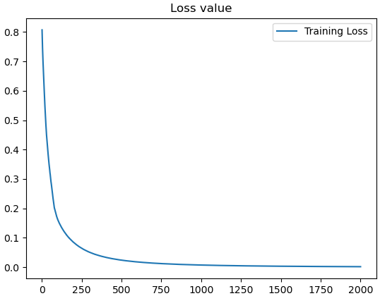
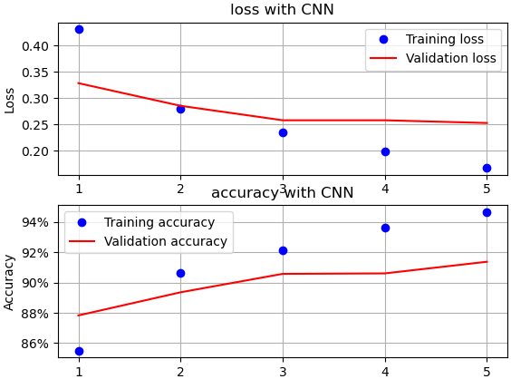

[toc]


# 卷积神经网络CNN

## 1.使用简单数据集构建CNN

使用自定义数据集，PyTorch期望输入的形状是 $N \times C \times H \times W$ ，下面输入2个数据，每个数据是4x4的，有1个通道。

```python
device = 'cuda' if torch.cuda.is_available() else 'cpu'

# torch.Size([2, 1, 4, 4]) 
X_train = torch.tensor([[[[1, 2, 3, 4], [2, 3, 4, 5], [5, 6, 7, 8], [1, 3, 4, 5]]],
                        [[[-1, 2, 3, -4], [2, -3, 4, 5], [-5, 6, -7, 8], [-1, -3, -4, -5]]]]).to(device).float()
# 输入缩放到-1到1之间
X_train /= 8
y_train = torch.tensor([0, 1]).to(device).float()
```

定义模型架构：

```python
def get_model():
    model = nn.Sequential(
        nn.Conv2d(1, 1, kernel_size=3),
        nn.MaxPool2d(2),
        nn.ReLU(),
        nn.Flatten(),
        nn.Linear(1, 1),
        nn.Sigmoid(),
    ).to(device)
    loss_fn = nn.BCELoss()
    optimizer = Adam(model.parameters(), lr=1e-2)
    return model, loss_fn, optimizer
```

`nn.Conv2d(1, 1, kernel_size=3),`：这是一个二维卷积层，指定输入通道数为1，输出通道数为1，卷积核大小为3x3。这意味着输入的数据是二维的。

`nn.MaxPool2d(2),`：二维最大池化层，池化窗口大小为2x2。

`nn.Flatten(),`：用于将多维输入数据（如特征图）展平成一维向量，以便后面的全连接层处理。

损失函数使用二分类交叉熵损失，优化器使用Adam。

> 图像是 `4x4` 的作为输入，卷积核是 `3x3` ，因此输出是 `2x2` ，经过 `2x2` 的池化层，输出变为 `1x1` ，最后经过线性全连接层输出1个结果。

> 输入与卷积层之间：卷积核3x3为9个参数，卷积层偏值需要1个参数。
>
> 扁平到线性层之间：输入输出都为1个节点，所以参数有1个，线性层偏值需要1个参数。
>
> 总共需要训练9+1+1+1=12个参数。

获取模型架构摘要：

```python
from torchsummary import summary

model, loss_fn, optimizer = get_model()
summary(model, (1, 4, 4))
'''
----------------------------------------------------------------
        Layer (type)               Output Shape         Param #
================================================================
            Conv2d-1              [-1, 1, 2, 2]              10
         MaxPool2d-2              [-1, 1, 1, 1]               0
              ReLU-3              [-1, 1, 1, 1]               0
           Flatten-4                    [-1, 1]               0
            Linear-5                    [-1, 1]               2
           Sigmoid-6                    [-1, 1]               0
================================================================
Total params: 12
Trainable params: 12
Non-trainable params: 0
----------------------------------------------------------------
Input size (MB): 0.00
Forward/backward pass size (MB): 0.00
Params size (MB): 0.00
Estimated Total Size (MB): 0.00
----------------------------------------------------------------
'''
```

训练模型：

```python
def train_batch(x, y, model, opt, loss_fn):
    model.train()
    prediction = model(x)
    batch_loss = loss_fn(prediction.flatten(), y)
    batch_loss.backward()
    opt.step()
    opt.zero_grad()
    return batch_loss.item()


trn_dl = DataLoader(TensorDataset(X_train, y_train))
losses = []
for epoch in range(2000):
    epoch_losses = []
    for ix, batch in enumerate(iter(trn_dl)):
        x, y = batch
        batch_loss = train_batch(x, y, model, optimizer, loss_fn)
        epoch_losses.append(batch_loss)
    epoch_loss = np.array(epoch_losses).mean()
    losses.append(epoch_loss)

epochs = np.arange(2000) + 1
plt.title('Loss value')
plt.plot(epochs, losses, label='Training Loss')
plt.legend()
plt.show()
```



在第一个数据上进行前向传播：

```python
print(model(X_train[:1]))
'''
tensor([[0.0033]], device='cuda:0', grad_fn=<SigmoidBackward0>)
'''
```

获取一个可能输出值：`0.0033`

---

现在让我们理解CNN的工作原理。

在 PyTorch 中，模型可以由多个子模块（如卷积层、全连接层等）组成，通过 `model.children()` 方法可以获取模型的所有子模块。

```python
print(list(model.children()))
'''
[Conv2d(1, 1, kernel_size=(3, 3), stride=(1, 1)), MaxPool2d(kernel_size=2, stride=2, padding=0, dilation=1, ceil_mode=False), ReLU(), Flatten(start_dim=1, end_dim=-1), Linear(in_features=1, out_features=1, bias=True), Sigmoid()]
'''
```

从模型的所有层中提取与权重属性相关的层：

```python
(cnn_w, cnn_b), (lin_w, lin_b) = [(layer.weight.data, layer.bias.data)
                                  for layer in list(model.children()) if hasattr(layer, 'weight')]

print(cnn_w)
print(cnn_b)
print(lin_w)
print(lin_b)
'''
tensor([[[[-1.3260,  0.5475,  0.8533],
          [ 0.7495, -1.4212,  0.8499],
          [-1.3079, -1.1657, -0.8810]]]], device='cuda:0')
tensor([0.5895], device='cuda:0')
tensor([[2.6379]], device='cuda:0')
tensor([-5.7652], device='cuda:0')
'''
```

注意卷积核尺寸为：`(1, 1, 3, 3)`

下面模拟卷积过程：

要对输入值执行 `cnn_w` 卷积运算，必须初始化求和的矩阵，该矩阵的维度：高度为图像高度减去滤波器高度再加一，宽度为图像宽度减去滤波器宽度再加一。

```python
# 图像的宽度和高度 4x4
h_im, w_im = X_train.shape[2:]
# 卷积核的宽度和高度 3x3
h_conv, w_conv = cnn_w.shape[2:]
# (2,2)
sumprod = torch.zeros((h_im - h_conv + 1, w_im - w_conv + 1))
```

然后执行卷积操作填充sumprod：

```python
for i in range(h_im - h_conv + 1):
    for j in range(w_im - w_conv + 1):
        # 切片待卷积区域
        img_subset = X_train[0, 0, i:(i + h_conv), j:(j + w_conv)]
        model_filter = cnn_w.reshape(3, 3)
        val = torch.sum(img_subset * model_filter) + cnn_b
        sumprod[i, j] = val
```

卷积之后有relu，池化，线性激活然后输出

```python
# relu 原地修改张量，所有小于0的元素都会被设置为0
sumprod.clamp_min_(0)

# 池化
pooling_layer_output = torch.max(sumprod)

# 线性激活
intermediate_output_value = pooling_layer_output * lin_w + lin_b
from torch.nn import functional as F  # torch library for numpy like functions

print(F.sigmoid(intermediate_output_value))
# 比较模型的输出
print(model(X_train[:1]))
'''
tensor([[5.9713e-05]], device='cuda:0')
tensor([[5.9713e-05]], device='cuda:0', grad_fn=<SigmoidBackward0>)
'''
```


## 2.使用深度CNN分类图像

使用Fashion-MINIST数据集，在导入数据集时，需要为图像数据指定通道，因此Fashion-MINIST数据集的每张图像为 `(1, 28, 28)`

```python
import torch
from torch import nn
from torch.optim import Adam
from torch.utils.data import TensorDataset, Dataset, DataLoader
import numpy as np
import matplotlib.pyplot as plt
from torchvision import datasets
from torchsummary import summary

device = 'cuda' if torch.cuda.is_available() else 'cpu'

data_folder = '~/data/FMNIST'
fmnist = datasets.FashionMNIST(data_folder, download=True, train=True)
tr_images = fmnist.data
tr_targets = fmnist.targets
val_fmnist = datasets.FashionMNIST(data_folder, download=True, train=False)
val_images = val_fmnist.data
val_targets = val_fmnist.targets


class FMNISTDataset(Dataset):
    def __init__(self, x, y):
        x = x.float() / 255
        x = x.view(-1, 1, 28, 28)  # 引入通道
        self.x, self.y = x, y

    def __getitem__(self, ix):
        x, y = self.x[ix], self.y[ix]
        return x.to(device), y.to(device)

    def __len__(self):
        return len(self.x)
```

CNN模型结构：

```python
def get_model():
    model = nn.Sequential(
        nn.Conv2d(1, 64, kernel_size=3),
        nn.MaxPool2d(2),
        nn.ReLU(),
        nn.Conv2d(64, 128, kernel_size=3),
        nn.MaxPool2d(2),
        nn.ReLU(),
        nn.Flatten(),
        nn.Linear(3200, 256),
        nn.ReLU(),
        nn.Linear(256, 10)
    ).to(device)

    loss_fn = nn.CrossEntropyLoss()
    optimizer = Adam(model.parameters(), lr=1e-3)
    return model, loss_fn, optimizer

trn_dl, val_dl = get_data()
model, loss_fn, optimizer = get_model()

summary(model, (1, 28, 28))
'''
----------------------------------------------------------------
        Layer (type)               Output Shape         Param #
================================================================
            Conv2d-1           [-1, 64, 26, 26]             640
         MaxPool2d-2           [-1, 64, 13, 13]               0
              ReLU-3           [-1, 64, 13, 13]               0
            Conv2d-4          [-1, 128, 11, 11]          73,856
         MaxPool2d-5            [-1, 128, 5, 5]               0
              ReLU-6            [-1, 128, 5, 5]               0
           Flatten-7                 [-1, 3200]               0
            Linear-8                  [-1, 256]         819,456
              ReLU-9                  [-1, 256]               0
           Linear-10                   [-1, 10]           2,570
================================================================
Total params: 896,522
Trainable params: 896,522
Non-trainable params: 0
----------------------------------------------------------------
Input size (MB): 0.00
Forward/backward pass size (MB): 0.69
Params size (MB): 3.42
Estimated Total Size (MB): 4.11
----------------------------------------------------------------
'''
```

> 输入：`(1, 28, 28)`
>
> 第一个卷积层参数：(1x3x3 + 1) x 64 = 640
>
> 第一个卷积层输出：`(64, 26, 26)`
>
> 经过池化输出：`(64, 13, 13)`
>
> 第二个卷积层参数：(64x3x3 + 1) x 128 = 73856
>
> 第二个卷积层输出：`(128, 11, 11)`
>
> 经过池化输出：`(128, 5, 5)`
>
> 压平：`(3200,)`
>
> 第一个线性层参数：(3200+1)x256 = 819456
>
> 第一个线性层输出：`(256,)`
>
> 第二个线性层参数：(256+1)x10 = 2570
>
> 第二个线性层输出：`(10,)`

> 总共参数：$640 + 73856 + 819456 + 2570 = 896522$

训练并可视化输出：

```python
train_losses, train_accuracies = [], []
val_losses, val_accuracies = [], []
for epoch in range(5):
    print(epoch)
    train_epoch_losses, train_epoch_accuracies = [], []
    for ix, batch in enumerate(iter(trn_dl)):
        x, y = batch
        batch_loss = train_batch(x, y, model, optimizer, loss_fn)
        train_epoch_losses.append(batch_loss)
        is_correct = accuracy(x, y, model)
        train_epoch_accuracies.extend(is_correct)
    train_epoch_loss = np.array(train_epoch_losses).mean()
    train_epoch_accuracy = np.mean(train_epoch_accuracies)

    for ix, batch in enumerate(iter(val_dl)):
        x, y = batch
        val_is_correct = accuracy(x, y, model)
        validation_loss = val_loss(x, y, model)
    val_epoch_accuracy = np.mean(val_is_correct)

    train_losses.append(train_epoch_loss)
    train_accuracies.append(train_epoch_accuracy)
    val_losses.append(validation_loss)
    val_accuracies.append(val_epoch_accuracy)

epochs = np.arange(5) + 1
import matplotlib.pyplot as plt
import matplotlib.ticker as mticker

plt.subplot(211)
plt.plot(epochs, train_losses, 'bo', label='Training loss')
plt.plot(epochs, val_losses, 'r', label='Validation loss')
plt.gca().xaxis.set_major_locator(mticker.MultipleLocator(1))
plt.title('loss with CNN')
# plt.xlabel('Epochs')
plt.ylabel('Loss')
plt.legend()
plt.grid('off')
# plt.show()
plt.subplot(212)
plt.plot(epochs, train_accuracies, 'bo', label='Training accuracy')
plt.plot(epochs, val_accuracies, 'r', label='Validation accuracy')
plt.gca().xaxis.set_major_locator(mticker.MultipleLocator(1))
plt.title('accuracy with CNN')
# plt.xlabel('Epochs')
plt.ylabel('Accuracy')
# plt.ylim(0.8,1)
plt.gca().set_yticklabels(['{:.0f}%'.format(x * 100) for x in plt.gca().get_yticks()])
plt.legend()
plt.grid('off')
plt.show()
```




## 3.数据增强

引入数据增强解决平移旋转的错误预测问题。

图像增强有助于从给定图像样本中创建更多图像样本。

`imgaug` 是一个 Python 库，用于在图像数据上执行增强操作，通常用于数据增强以增加机器学习模型的性能和泛化能力。它提供了许多用于图像增强的功能，例如随机裁剪、旋转、缩放、翻转、变形等。这些操作可以用来生成具有一定差异性的图像数据，从而增加模型对于各种变化的适应能力。

`imgaug` 提供了灵活的 API，允许用户以不同的方式组合和配置增强操作。它还提供了与其他流行的 Python 图像处理库（如 OpenCV 和 scikit-image）无缝集成的功能。


## 完整代码

### 1.

模型代码

```python
import torch
from torch import nn
from torch.utils.data import TensorDataset, Dataset, DataLoader
from torch.optim import SGD, Adam
from torchvision import datasets
import numpy as np
import matplotlib.pyplot as plt

device = 'cuda' if torch.cuda.is_available() else 'cpu'

# torch.Size([2, 1, 4, 4])
X_train = torch.tensor([[[[1, 2, 3, 4], [2, 3, 4, 5], [5, 6, 7, 8], [1, 3, 4, 5]]],
                        [[[-1, 2, 3, -4], [2, -3, 4, 5], [-5, 6, -7, 8], [-1, -3, -4, -5]]]]).to(device).float()
# 输入缩放到-1到1之间
X_train /= 8
y_train = torch.tensor([0, 1]).to(device).float()


def get_model():
    model = nn.Sequential(
        nn.Conv2d(1, 1, kernel_size=3),
        nn.MaxPool2d(2),
        nn.ReLU(),
        nn.Flatten(),
        nn.Linear(1, 1),
        nn.Sigmoid(),
    ).to(device)
    loss_fn = nn.BCELoss()
    optimizer = Adam(model.parameters(), lr=1e-2)
    return model, loss_fn, optimizer


from torchsummary import summary

model, loss_fn, optimizer = get_model()
summary(model, (1, 4, 4))


def train_batch(x, y, model, opt, loss_fn):
    model.train()
    prediction = model(x)
    batch_loss = loss_fn(prediction.flatten(), y)
    batch_loss.backward()
    opt.step()
    opt.zero_grad()
    return batch_loss.item()


trn_dl = DataLoader(TensorDataset(X_train, y_train))
losses = []
for epoch in range(2000):
    epoch_losses = []
    for ix, batch in enumerate(iter(trn_dl)):
        x, y = batch
        batch_loss = train_batch(x, y, model, optimizer, loss_fn)
        epoch_losses.append(batch_loss)
    epoch_loss = np.array(epoch_losses).mean()
    losses.append(epoch_loss)

print(model(X_train[:1]))
print(list(model.children()))

epochs = np.arange(2000) + 1
plt.title('Loss value')
plt.plot(epochs, losses, label='Training Loss')
plt.legend()
plt.show()
```

模拟卷积过程代码：

```python
import torch
from torch import nn
from torch.optim import Adam
from torch.utils.data import TensorDataset, Dataset, DataLoader
import numpy as np
import matplotlib.pyplot as plt

device = 'cuda' if torch.cuda.is_available() else 'cpu'

# torch.Size([2, 1, 4, 4])
X_train = torch.tensor([[[[1, 2, 3, 4], [2, 3, 4, 5], [5, 6, 7, 8], [1, 3, 4, 5]]],
                        [[[-1, 2, 3, -4], [2, -3, 4, 5], [-5, 6, -7, 8], [-1, -3, -4, -5]]]]).to(device).float()
# 输入缩放到-1到1之间
X_train /= 8
y_train = torch.tensor([0, 1]).to(device).float()


def get_model():
    model = nn.Sequential(
        nn.Conv2d(1, 1, kernel_size=3),
        nn.MaxPool2d(2),
        nn.ReLU(),
        nn.Flatten(),
        nn.Linear(1, 1),
        nn.Sigmoid(),
    ).to(device)
    loss_fn = nn.BCELoss()
    optimizer = Adam(model.parameters(), lr=1e-2)
    return model, loss_fn, optimizer


from torchsummary import summary

model, loss_fn, optimizer = get_model()


# summary(model, (1, 4, 4))


def train_batch(x, y, model, opt, loss_fn):
    model.train()
    prediction = model(x)
    # batch_loss = loss_fn(prediction.flatten(), y)
    batch_loss = loss_fn(torch.squeeze(prediction, 0), y)
    batch_loss.backward()
    opt.step()
    opt.zero_grad()
    return batch_loss.item()


trn_dl = DataLoader(TensorDataset(X_train, y_train))
losses = []
for epoch in range(2000):
    epoch_losses = []
    for ix, batch in enumerate(iter(trn_dl)):
        x, y = batch
        batch_loss = train_batch(x, y, model, optimizer, loss_fn)
        epoch_losses.append(batch_loss)
    epoch_loss = np.array(epoch_losses).mean()
    losses.append(epoch_loss)

(cnn_w, cnn_b), (lin_w, lin_b) = [(layer.weight.data, layer.bias.data)
                                  for layer in list(model.children()) if hasattr(layer, 'weight')]

print(cnn_w)
print(cnn_b)
print(lin_w)
print(lin_b)

# 图像的宽度和高度 4x4
h_im, w_im = X_train.shape[2:]
# 卷积核的宽度和高度 3x3
h_conv, w_conv = cnn_w.shape[2:]
# (2,2)
sumprod = torch.zeros((h_im - h_conv + 1, w_im - w_conv + 1))

for i in range(h_im - h_conv + 1):
    for j in range(w_im - w_conv + 1):
        # 切片待卷积区域
        img_subset = X_train[0, 0, i:(i + h_conv), j:(j + w_conv)]
        # model_filter = cnn_w.reshape(3, 3)
        # model_filter = cnn_w.reshape(h_conv, w_conv)
        model_filter = torch.squeeze(cnn_w)
        val = torch.sum(img_subset * model_filter) + cnn_b
        sumprod[i, j] = val

# relu 原地修改张量，所有小于0的元素都会被设置为0
sumprod.clamp_min_(0)

# 池化
pooling_layer_output = torch.max(sumprod)

# 线性激活
intermediate_output_value = pooling_layer_output * lin_w + lin_b
from torch.nn import functional as F  # torch library for numpy like functions

print(F.sigmoid(intermediate_output_value))

print(model(X_train[:1]))
print(list(model.children()))

epochs = np.arange(2000) + 1
plt.title('Loss value')
plt.plot(epochs, losses, label='Training Loss')
plt.legend()
plt.show()
```


### 2.

```python
import torch
from torch import nn
from torch.optim import Adam
from torch.utils.data import TensorDataset, Dataset, DataLoader
import numpy as np
import matplotlib.pyplot as plt
from torchvision import datasets
from torchsummary import summary

device = 'cuda' if torch.cuda.is_available() else 'cpu'

data_folder = '~/data/FMNIST'
fmnist = datasets.FashionMNIST(data_folder, download=True, train=True)
tr_images = fmnist.data
tr_targets = fmnist.targets
val_fmnist = datasets.FashionMNIST(data_folder, download=True, train=False)
val_images = val_fmnist.data
val_targets = val_fmnist.targets


class FMNISTDataset(Dataset):
    def __init__(self, x, y):
        x = x.float() / 255
        x = x.view(-1, 1, 28, 28)  # 引入通道
        self.x, self.y = x, y

    def __getitem__(self, ix):
        x, y = self.x[ix], self.y[ix]
        return x.to(device), y.to(device)

    def __len__(self):
        return len(self.x)


def get_model():
    model = nn.Sequential(
        nn.Conv2d(1, 64, kernel_size=3),
        nn.MaxPool2d(2),
        nn.ReLU(),
        nn.Conv2d(64, 128, kernel_size=3),
        nn.MaxPool2d(2),
        nn.ReLU(),
        nn.Flatten(),
        nn.Linear(3200, 256),
        nn.ReLU(),
        nn.Linear(256, 10)
    ).to(device)

    loss_fn = nn.CrossEntropyLoss()
    optimizer = Adam(model.parameters(), lr=1e-3)
    return model, loss_fn, optimizer


def train_batch(x, y, model, opt, loss_fn):
    prediction = model(x)
    batch_loss = loss_fn(prediction, y)
    batch_loss.backward()
    opt.step()
    opt.zero_grad()
    return batch_loss.item()


@torch.no_grad()
def accuracy(x, y, model):
    model.eval()
    prediction = model(x)
    max_values, argmaxes = prediction.max(-1)
    is_correct = argmaxes == y
    return is_correct.cpu().numpy().tolist()


def get_data():
    train = FMNISTDataset(tr_images, tr_targets)
    trn_dl = DataLoader(train, batch_size=32, shuffle=True)
    val = FMNISTDataset(val_images, val_targets)
    val_dl = DataLoader(val, batch_size=len(val_images), shuffle=True)
    return trn_dl, val_dl


@torch.no_grad()
def val_loss(x, y, model):
    model.eval()
    prediction = model(x)
    val_loss = loss_fn(prediction, y)
    return val_loss.item()


trn_dl, val_dl = get_data()
model, loss_fn, optimizer = get_model()

summary(model, (1, 28, 28))

train_losses, train_accuracies = [], []
val_losses, val_accuracies = [], []
for epoch in range(5):
    print(epoch)
    train_epoch_losses, train_epoch_accuracies = [], []
    for ix, batch in enumerate(iter(trn_dl)):
        x, y = batch
        batch_loss = train_batch(x, y, model, optimizer, loss_fn)
        train_epoch_losses.append(batch_loss)
        is_correct = accuracy(x, y, model)
        train_epoch_accuracies.extend(is_correct)
    train_epoch_loss = np.array(train_epoch_losses).mean()
    train_epoch_accuracy = np.mean(train_epoch_accuracies)

    for ix, batch in enumerate(iter(val_dl)):
        x, y = batch
        val_is_correct = accuracy(x, y, model)
        validation_loss = val_loss(x, y, model)
    val_epoch_accuracy = np.mean(val_is_correct)

    train_losses.append(train_epoch_loss)
    train_accuracies.append(train_epoch_accuracy)
    val_losses.append(validation_loss)
    val_accuracies.append(val_epoch_accuracy)

epochs = np.arange(5) + 1
import matplotlib.pyplot as plt
import matplotlib.ticker as mticker

plt.subplot(211)
plt.plot(epochs, train_losses, 'bo', label='Training loss')
plt.plot(epochs, val_losses, 'r', label='Validation loss')
plt.gca().xaxis.set_major_locator(mticker.MultipleLocator(1))
plt.title('loss with CNN')
# plt.xlabel('Epochs')
plt.ylabel('Loss')
plt.legend()
plt.grid('off')
# plt.show()
plt.subplot(212)
plt.plot(epochs, train_accuracies, 'bo', label='Training accuracy')
plt.plot(epochs, val_accuracies, 'r', label='Validation accuracy')
plt.gca().xaxis.set_major_locator(mticker.MultipleLocator(1))
plt.title('accuracy with CNN')
# plt.xlabel('Epochs')
plt.ylabel('Accuracy')
# plt.ylim(0.8,1)
plt.gca().set_yticklabels(['{:.0f}%'.format(x * 100) for x in plt.gca().get_yticks()])
plt.legend()
plt.grid('off')
plt.show()
```


### 3.


